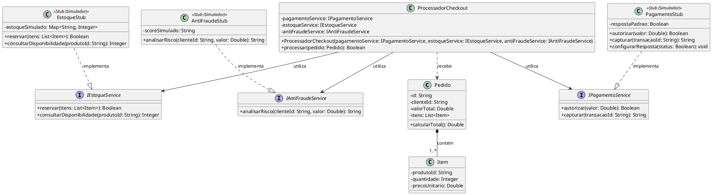

::: {.callout-note}
## Contexto da prática
Nas atividades de Engenharia de Software, compreender como as estratégias de teste se materializam na arquitetura de sistemas reais é fundamental para projetar suítes de teste eficazes, econômicas e sustentáveis.

Neste laboratório, você realizará uma **atividade de pesquisa aplicada e modelagem técnica**, mapeando cada nível e abordagem de teste apresentados na Aula 02 para cenários de sistemas fictícios que imitam desafios reais do mercado.
:::

---

## 🎯 Objetivos de Aprendizagem

Ao concluir este laboratório, você será capaz de:

1. **Modelar cenários práticos de teste**: Representar graficamente, por meio de diagramas de classes, componentes ou sequência, como diferentes abordagens de teste são estruturadas.
2. **Diferenciar níveis e técnicas de teste**: Explicar com precisão o papel de *stubs*, *drivers*, testes de fumaça, regressão, aceitação e testes de sistema (*stress*, recuperação, segurança e desempenho).
3. **Utilizar Inteligência Artificial Generativa com responsabilidade técnica**: Empregar prompts estruturados para brainstorming arquitetural e geração de diagramas, mantendo o domínio crítico e a capacidade de defender oralmente todas as escolhas técnicas.
4. **Documentar artefatos de engenharia**: Organizar relatórios técnicos com diagramas integrados e justificativas conceituais.

---

## 🤖 Política de Uso de Inteligência Artificial

::: {.callout-important}
### Uso ético, produtivo e responsável de IA
* **Uso incentivado**: Você é encorajado a utilizar assistentes de IA generativa (como ChatGPT, Claude, Gemini, DeepSeek ou GitHub Copilot) para acelerar a idealização de cenários, estruturar rascunhos de diagramas em sintaxe Mermaid/PlantUML e refinar a clareza da sua escrita técnica.
* **Critério de responsabilidade e arguição**: A IA é uma ferramenta de apoio, mas **a autoria intelectual e a responsabilidade pelo conteúdo são 100% suas**. Durante as aulas presenciais, o professor poderá solicitar que você explique qualquer diagrama, justifique o papel de cada componente, *stub* ou *driver*, e defenda a coerência do teste proposto.
* Se você não souber explicar o que está no seu diagrama ou no seu texto, a atividade será desconsiderada.
:::

---

## 📋 Escopo da Atividade de Pesquisa e Modelagem

Escolha um **domínio de sistema fictício realista** para contextualizar seus exemplos. Sugestões de domínios:

* Plataforma de *E-commerce* e *Marketplace* de grande porte.
* Sistema de Transferências Bancárias Instantâneas (*Gateway Pix*).
* Aplicativo de *Streaming* de Vídeo sob Demanda.
* Plataforma de Telemedicina e Agendamento de Consultas.
* Sistema de Bilhetagem e Rastreamento de Transporte Público.

Para o sistema escolhido, você deverá pesquisar, conceber e documentar **todas as abordagens listadas abaixo**, divididas pelos 4 níveis clássicos de teste:

```
├── 1. Teste de Unidade (Unit Testing)
│   └── 1.1 Verificação de lógica atômica em componente/classe isolada
│
├── 2. Teste de Integração (Integration Testing)
│   ├── 2.1 Integração Não Incremental (Big Bang)
│   ├── 2.2 Integração Incremental Top-Down (Descendente) com uso de Stubs
│   ├── 2.3 Integração Incremental Bottom-Up (Ascendente) com uso de Drivers
│   ├── 2.4 Teste de Fumaça (Smoke Testing)
│   └── 2.5 Teste de Regressão
│
├── 3. Teste de Validação (Validation Testing)
│   ├── 3.1 Critérios de Aceitação (User Acceptance Testing)
│   ├── 3.2 Teste Alfa (Alpha Testing)
│   └── 3.3 Teste Beta (Beta Testing)
│
└── 4. Teste de Sistema (System Testing)
    ├── 4.1 Teste de Recuperação (Recovery Testing)
    ├── 4.2 Teste de Segurança (Security Testing)
    ├── 4.3 Teste de Estresse (Stress Testing)
    └── 4.4 Teste de Desempenho (Performance Testing)
```

---

## 📝 O que entregar para cada abordagem

Para **cada uma das 13 abordagens** acima, sua entrega deve conter obrigatoriamente:

1. **Diagrama Visual Cabível (UML / Arquitetura)**:
   * Diagrama de Classes, Diagrama de Componentes ou Diagrama de Sequência ilustrando as partes do sistema envolvidas no teste.
   * Quando aplicável, identifique com clareza os módulos sob teste, componentes reais, *stubs*, *drivers*, agentes externos ou pontos de injeção de falha.
   * Dica: use blocos de código `mermaid` no Markdown para renderização nativa.
2. **Explicação Textual Correlacionada**:
   * Descrição objetiva de como o teste opera no cenário desenhado.
   * Explicação direta referenciando os nomes de classes, métodos, interfaces e mensagens presentes no diagrama.
   * Indicação clara do objetivo do teste e do tipo de defeito que ele visa revelar.

---

## 🌟 Exemplo Modelo ("Guia do Estudante")

Abaixo apresentamos um exemplo de referência completo para a abordagem **2.2 — Integração Incremental *Top-Down* com *Stubs*** no domínio de *E-commerce*. Utilize este nível de detalhe e clareza como padrão para a sua pesquisa:

### Exemplo: 2.2 — Integração Incremental *Top-Down* (*Checkout de E-commerce*)

#### 1. Diagrama de Classes UML

Seguem exemplos de diagramas que ilustram a aplicação deste conceito no cenário proposto.

### Visualização PlantUML


### Visualização Mermaid
```{mermaid}
classDiagram
    class Pedido {
        -String id
        -String clienteId
        -Double valorTotal
        -List~Item~ itens
        +calcularTotal() Double
    }

    class Item {
        -String produtoId
        -Integer quantidade
        -Double precoUnitario
    }

    class ProcessadorCheckout {
        -IPagamentoService pagamentoService
        -IEstoqueService estoqueService
        -IAntiFraudeService antiFraudeService
        +processar(Pedido pedido) Boolean
    }

    class IPagamentoService {
        <<interface>>
        +autorizar(Double valor) Boolean
        +capturar(String transacaoId) String
    }

    class IEstoqueService {
        <<interface>>
        +reservar(List~Item~ itens) Boolean
        +consultarDisponibilidade(String produtoId) Integer
    }

    class IAntiFraudeService {
        <<interface>>
        +analisarRisco(String clienteId, Double valor) String
    }

    class PagamentoStub {
        <<service>>
        -Boolean respostaPadrao
        +autorizar(Double valor) Boolean
        +capturar(String transacaoId) String
        +configurarResposta(Boolean status) void
    }

    class EstoqueStub {
        <<service>>
        -Map~String, Integer~ estoqueSimulado
        +reservar(List~Item~ itens) Boolean
        +consultarDisponibilidade(String produtoId) Integer
    }

    class AntiFraudeStub {
        <<service>>
        -String scoreSimulado
        +analisarRisco(String clienteId, Double valor) String
    }

    Pedido *-- Item : contem
    ProcessadorCheckout ..> Pedido : recebe
    ProcessadorCheckout --> IPagamentoService : utiliza
    ProcessadorCheckout --> IEstoqueService : utiliza
    ProcessadorCheckout --> IAntiFraudeService : utiliza

    PagamentoStub ..|> IPagamentoService : implementa
    EstoqueStub ..|> IEstoqueService : implementa
    AntiFraudeStub ..|> IAntiFraudeService : implementa
```


#### 2. Código-fonte do Diagrama (Mermaid e PlantUML)

Observe como o diagrama acima pode ser expresso em sintaxe textual tanto no **Mermaid** quanto no **PlantUML**:

::: {.panel-tabset}
### Sintaxe Mermaid
```text
classDiagram
    class Pedido {
        -String id
        -String clienteId
        -Double valorTotal
        -List~Item~ itens
        +calcularTotal() Double
    }

    class Item {
        -String produtoId
        -Integer quantidade
        -Double precoUnitario
    }

    class ProcessadorCheckout {
        -IPagamentoService pagamentoService
        -IEstoqueService estoqueService
        -IAntiFraudeService antiFraudeService
        +processar(Pedido pedido) Boolean
    }

    class IPagamentoService {
        <<interface>>
        +autorizar(Double valor) Boolean
        +capturar(String transacaoId) String
    }

    class IEstoqueService {
        <<interface>>
        +reservar(List~Item~ itens) Boolean
        +consultarDisponibilidade(String produtoId) Integer
    }

    class IAntiFraudeService {
        <<interface>>
        +analisarRisco(String clienteId, Double valor) String
    }

    class PagamentoStub {
        <<service>>
        -Boolean respostaPadrao
        +autorizar(Double valor) Boolean
        +capturar(String transacaoId) String
        +configurarResposta(Boolean status) void
    }

    class EstoqueStub {
        <<service>>
        -Map~String, Integer~ estoqueSimulado
        +reservar(List~Item~ itens) Boolean
        +consultarDisponibilidade(String produtoId) Integer
    }

    class AntiFraudeStub {
        <<service>>
        -String scoreSimulado
        +analisarRisco(String clienteId, Double valor) String
    }

    Pedido *-- Item : contem
    ProcessadorCheckout ..> Pedido : recebe
    ProcessadorCheckout --> IPagamentoService : utiliza
    ProcessadorCheckout --> IEstoqueService : utiliza
    ProcessadorCheckout --> IAntiFraudeService : utiliza

    PagamentoStub ..|> IPagamentoService : implementa
    EstoqueStub ..|> IEstoqueService : implementa
    AntiFraudeStub ..|> IAntiFraudeService : implementa
```

* 📖 [Documentação Oficial do Mermaid](https://mermaid.js.org/)
* 💻 [Simulador Online — Mermaid Live Editor](https://mermaid.live/)

### Sintaxe PlantUML
```text
@startuml
skinparam classAttributeIconSize 0

class Pedido {
  - id: String
  - clienteId: String
  - valorTotal: Double
  - itens: List<Item>
  + calcularTotal(): Double
}

class Item {
  - produtoId: String
  - quantidade: Integer
  - precoUnitario: Double
}

class ProcessadorCheckout {
  - pagamentoService: IPagamentoService
  - estoqueService: IEstoqueService
  - antiFraudeService: IAntiFraudeService
  + ProcessadorCheckout(pagamentoService: IPagamentoService, estoqueService: IEstoqueService, antiFraudeService: IAntiFraudeService)
  + processar(pedido: Pedido): Boolean
}

interface IPagamentoService {
  + autorizar(valor: Double): Boolean
  + capturar(transacaoId: String): String
}

interface IEstoqueService {
  + reservar(itens: List<Item>): Boolean
  + consultarDisponibilidade(produtoId: String): Integer
}

interface IAntiFraudeService {
  + analisarRisco(clienteId: String, valor: Double): String
}

class PagamentoStub <<Stub (Simulador)>> {
  - respostaPadrao: Boolean
  + autorizar(valor: Double): Boolean
  + capturar(transacaoId: String): String
  + configurarResposta(status: Boolean): void
}

class EstoqueStub <<Stub (Simulador)>> {
  - estoqueSimulado: Map<String, Integer>
  + reservar(itens: List<Item>): Boolean
  + consultarDisponibilidade(produtoId: String): Integer
}

class AntiFraudeStub <<Stub (Simulador)>> {
  - scoreSimulado: String
  + analisarRisco(clienteId: String, valor: Double): String
}

Pedido *-- "1..*" Item : contém
ProcessadorCheckout ..> Pedido : recebe
ProcessadorCheckout --> IPagamentoService : utiliza
ProcessadorCheckout --> IEstoqueService : utiliza
ProcessadorCheckout --> IAntiFraudeService : utiliza

PagamentoStub ..|> IPagamentoService : implementa
EstoqueStub ..|> IEstoqueService : implementa
AntiFraudeStub ..|> IAntiFraudeService : implementa
@enduml
```

* 📖 [Documentação Oficial do PlantUML](https://plantuml.com/)
* 💻 [Simulador Online — PlantText Editor](https://www.planttext.com/)
* 💻 [Servidor Online Oficial — PlantUML Web Server](https://www.plantuml.com/plantuml/uml/)
:::

::: {.callout-note}
### 🛠️ Ferramentas, Documentação e Simuladores Online
Você pode testar, editar e visualizar seus diagramas diretamente no navegador antes de colocá-los no seu relatório:

* **Mermaid**: [Documentação Oficial](https://mermaid.js.org/) | [Mermaid Live Editor](https://mermaid.live/) (renderização em tempo real).
* **PlantUML**: [Documentação Oficial](https://plantuml.com/) | [PlantText Editor](https://www.planttext.com/) | [PlantUML Web Server](https://www.plantuml.com/plantuml/uml/).
:::

::: {.callout-tip}
### 📚 Precisa revisar modelagem com Diagramas de Classes?
Se você precisa relembrar os conceitos de classes, interfaces, visibilidade (`+`, `-`, `#`), atributos, métodos e tipos de relacionamentos (associação, agregação, composição, dependência e realização), consulte a aula do professor:

👉 **[Modelagem de Software com Diagramas de Classes UML](https://maxwellamaral.github.io/lessons/softeng/design/uml_classes/)**
:::

#### 3. Explicação Textual do Cenário

> **Contexto**: No desenvolvimento do fluxo de finalização de compras, a classe de controle de alto nível `ProcessadorCheckout` precisa orquestrar validação de risco, reserva de produtos e cobrança financeira. No entanto, as integrações reais com adquirentes de cartão (`IPagamentoService`), armazém logístico (`IEstoqueService`) e birô de crédito (`IAntiFraudeService`) são lentas, custosas ou ainda estão sendo desenvolvidas por outras equipes.
>
> **Como a abordagem Top-Down com Classes e Stubs é aplicada**:
> 1. **Classe Real de Alto Nível sob Teste**: A classe controladora `ProcessadorCheckout` é implementada e testada no topo da hierarquia de integração.
> 2. **Interfaces e Classes *Stub***: São criadas as implementações simuladas `PagamentoStub`, `EstoqueStub` e `AntiFraudeStub`, que implementam os contratos das respectivas interfaces fornecendo retornos previsíveis em memória (ex.: `PagamentoStub.autorizar()` retorna imediatamente `True` sem realizar chamadas de rede reais).
> 3. **Injeção de Dependências**: Na suíte de testes de integração, os *stubs* são injetados no construtor de `ProcessadorCheckout`, permitindo testar a lógica orquestradora: ordem de execução (antifraude $\rightarrow$ estoque $\rightarrow$ pagamento), tratamento de exceções quando um stub simula falha e persistência do estado do `Pedido`.
> 4. **Avanço na Espiral de Testes**: À medida que os módulos reais de infraestrutura ficarem prontos, cada *stub* é gradualmente substituído pela classe concreta real (ex.: `CieloPaymentGateway` substituindo `PagamentoStub`), validando a integração descendente camada por camada.

---

## 💡 Guia de Prompts para Apoio com IA Generativa

Para tirar o melhor proveito dos assistentes de IA durante a sua pesquisa, utilize prompts que orientem a ferramenta a atuar como um engenheiro de qualidade sênior:

### Prompt 1: Brainstorming e Definição da Arquitetura
```text
Atue como um arquiteto de software e engenheiro de testes sênior.
Estou desenvolvendo um estudo de caso sobre estratégias de teste para um sistema fictício de [inserir domínio, ex: Gateway de Pagamentos Pix].
Para o nível de "Teste de Integração", especificamente a abordagem "Integração Incremental Bottom-Up com Drivers", proponha:
1. Uma hierarquia de 3 classes/módulos atômicos da base e um módulo superior que consome esses serviços.
2. Como um 'Driver de Teste' deve ser projetado para exercitar esses módulos antes do controlador principal existir.
3. Quais defeitos de interface essa abordagem detecta com facilidade.
```

### Prompt 2: Geração de Diagramas em Sintaxe Mermaid
```text
Com base no cenário de [descrever o cenário, ex: Teste de Recuperação em Sistema de Streaming], gere um diagrama de sequência em sintaxe Mermaid válido.
O diagrama deve ilustrar:
- A aplicação cliente fazendo requisição.
- O nó primário do banco de dados sofrendo uma queda abrupta (crash).
- O mecanismo de failover redirecionando para o nó réplica secundário.
- A resposta sendo entregue ao cliente sem interrupção de serviço.
Formate apenas o bloco de código mermaid com rótulos em português.
```

### Prompt 3: Autoarguição e Validação Crítica
```text
Atue como um professor universitário de Engenharia de Software da disciplina de Verificação, Validação e Testes.
Analise a seguinte explicação que elaborei para o conceito de "Teste de Fumaça (Smoke Testing)":
"[Cole aqui o seu texto e a descrição do seu diagrama]"
Faça 3 perguntas técnicas desafiadoras sobre as decisões desse teste para avaliar se eu realmente compreendi o conceito ou se apenas gerei o texto superficialmente.
```

---

## 📁 Sugestão de Organização e Armazenamento dos Resultados

Recomendamos que você estruture o resultado da sua pesquisa em formato digital profissional. Duas opções sugeridas:

### Opção 1 (Recomendada — Markdown / Repositório Git)
Crie um repositório no GitHub ou uma pasta no seu ambiente de estudos com a seguinte estrutura:

```text
meu-estudo-vvts/
├── README.md                 # Relatório principal com os diagramas Mermaid
├── diagramas/                # Cópias ou fontes dos diagramas (opcional)
└── prompts_utilizados.md     # Registro dos prompts que você usou com a IA
```

No arquivo `README.md`, você pode estruturar cada seção com títulos numerados (ex.: `## 1. Teste de Unidade`, `## 2. Teste de Integração`, etc.), incluindo os blocos de código ` ```mermaid ` diretamente no documento. O GitHub renderiza diagramas Mermaid automaticamente!

### Opção 2 (Documento Estruturado / PDF)
Elabore um documento técnico no Notion, Obsidian ou Google Docs exportado em PDF, garantindo que os diagramas estejam em alta resolução, com títulos e legendas numeradas.

---

## ✅ Critérios de Conclusão e Autoavaliação

Antes de considerar sua atividade finalizada, confira o seguinte *checklist*:

- [ ] **Cobertura Completa**: Todas as 13 abordagens dos 4 níveis de teste foram contempladas no contexto do domínio escolhido.
- [ ] **Diagramas Coerentes**: Cada abordagem possui um diagrama UML visualmente claro, identificando os papéis dos módulos e pontos de teste.
- [ ] **Vínculo Texto-Diagrama**: A explicação textual faz referência explícita aos elementos presentes no diagrama.
- [ ] **Diferenciação Rigorosa**: *Stubs* e *Drivers* foram usados nos níveis corretos (Top-Down versus Bottom-Up) sem inversão conceitual.
- [ ] **Domínio para Arguição**: Você está apto a ir ao quadro ou compartilhar a tela e explicar o funcionamento de qualquer um dos seus diagramas quando arguido pelo professor.

---

## 🔗 Materiais Relacionados

* [Aula 02 — Introdução à Gestão da Qualidade de Produto](index.qmd)
* [Apresentação de Slides da Aula 02](slides.qmd)
* [Material de Apoio: Modelagem de Software com Diagramas de Classes UML (Prof. Maxwell Amaral)](https://maxwellamaral.github.io/lessons/softeng/design/uml_classes/)
* [Mermaid — Documentação Oficial e Live Editor](https://mermaid.js.org/)
* [PlantUML — Documentação Oficial e PlantText Editor](https://plantuml.com/)
* @pressman2016 — Capítulo 22 (*Estratégias de Teste de Software*)
* @delamaro2007 — Capítulo 1 (*Conceitos Básicos de Teste de Software*)
