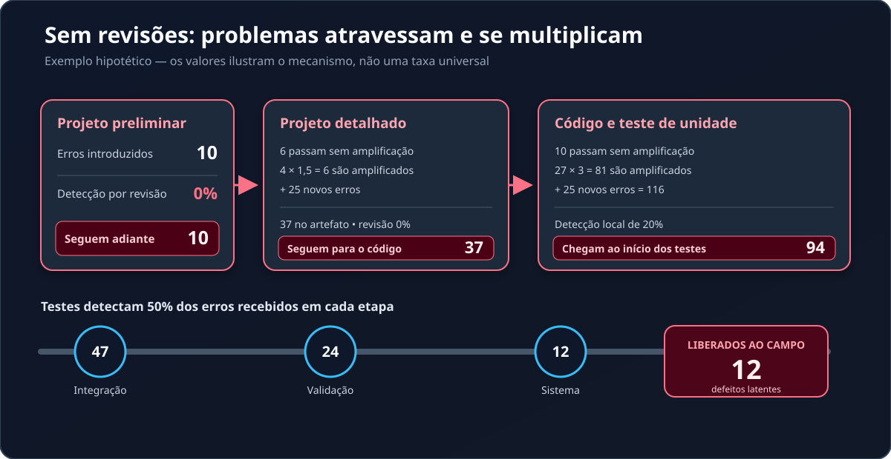
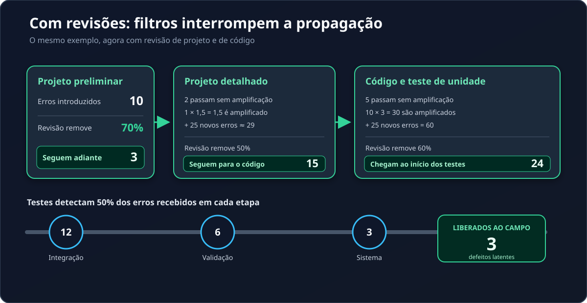
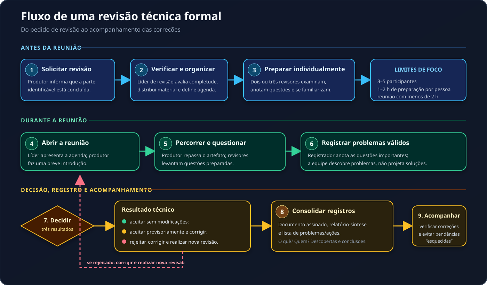

## Verificação Estática {.section .lead}

**Revisões, testes de mesa, walkthroughs e inspeções**

Antes de executar o software, o que já podemos verificar no requisito, no código e nos testes?

[📖 Acessar conteúdo escrito da aula](index.qmd){.slide-link}

## Que evidência existe antes da execução? {.question}

::: {.chapter}
O problema
:::

Uma equipe ainda não executou o sistema.

Mesmo assim, ela encontra:

- uma regra ambígua;
- uma condição de fronteira ausente;
- uma inconsistência entre requisito e código;
- uma violação de padrão.

Isso é opinião — ou evidência para qualidade?

## Verificar não é executar {.concept .definition}

::: {.chapter}
Duas formas de obter evidência
:::

**Verificação estática** examina artefatos sem exercitar o software:

- requisitos e critérios de aceitação;
- modelos, diagramas e documentação;
- código, configurações e casos de teste.

**Verificação dinâmica** observa o comportamento durante a execução.

As duas abordagens se complementam [@pressman2016].

## Revisar não é depurar nem testar {.example}

::: {.chapter}
Duas formas de obter evidência
:::

| Atividade | Pergunta principal |
|---|---|
| **Revisão** | O artefato é consistente com sua referência? |
| <span class="custom-tooltip">**Teste de mesa**<span class="tooltip-box">O <strong>teste de mesa</strong> (<em>desk checking</em>) é uma técnica de <strong>verificação estática informal</strong> na qual a própria pessoa autora e/ou revisores percorrem logicamente um artefato de software (como código-fonte, algoritmo, modelo ou requisito).</span></span> | O fluxo lógico revela uma questão no artefato? |
| **Teste dinâmico** | O comportamento observado diverge do esperado? |
| **Depuração** | Qual é a causa e como corrigir sem introduzir outra falha? |

Uma inspeção pode encontrar uma inconsistência; a correção ainda precisa ser implementada e verificada.

## Por que revisar cedo? {.question}

::: {.chapter}
Custo e propagação
:::

Um problema em uma decisão de projeto pode chegar ao código, aos testes e à produção.

Em cada etapa, novos artefatos podem ser construídos sobre uma premissa incorreta.

**O que acontece com o custo de correção quando a descoberta é adiada?**

## O Modelo de Amplificação de Defeitos {.concept}

::: {.chapter}
Custo e propagação
:::

Pressman usa um modelo para mostrar como erros não identificados podem ser **propagados e amplificados** durante o desenvolvimento [@pressman2016].

```{mermaid}
%%{init: {'theme': 'dark'}}%%
flowchart LR
    A[Requisitos / projeto] --> B[Projeto detalhado]
    B --> C[Código e testes]
    C --> D[Produção]
```

A revisão atua como um filtro antes que uma decisão incorreta afete mais artefatos.

**O filtro alcança requisitos, modelos de projeto, dados de teste e código — não apenas o produto executável.**

## Sem revisões: o fluxo acumula erros {.example}



<p class="caption">Exemplo hipotético de Pressman e Maxim; os valores não são taxas universais.</p>

## Com revisões: filtros interrompem a propagação {.example}



<p class="caption">O mesmo exemplo, agora com revisões de projeto e de código.</p>

## Um contraste hipotético de Pressman {.example}

::: {.chapter}
Custo e propagação
:::

O exemplo parte de **10 defeitos preliminares de projeto**. Não é uma taxa universal para qualquer equipe ou produto [@pressman2016].

| Cenário | Antes dos testes | Erros latentes no campo |
|---|---:|---:|
| Sem revisões de projeto e código | **94** | **12** |
| Com revisões de projeto e código | **24** | **3** |

No exemplo, o custo total sem revisões é aproximadamente três vezes maior [@pressman2016].

## O filtro precisa ser proporcional {.takeaway}

::: {.chapter}
Custo e propagação
:::

> “Revisões são como um filtro no fluxo de trabalho da gestão de qualidade. Um número muito pequeno de revisões e o fluxo será ‘sujo’. Um número muito grande de revisões e o fluxo diminui muito e vira um gotejamento.” [@pressman2016]

Não se trata de revisar tudo com o mesmo rigor.

Trata-se de escolher uma evidência proporcional ao **risco**, ao **impacto** e ao **tamanho do artefato**.

## Toda leitura é uma inspeção? {.question}

::: {.chapter}
Técnicas de revisão
:::

Uma pessoa lê o código de outra e deixa um comentário.

Outra equipe faz preparação individual, usa checklist, registra descobertas e acompanha pendências.

As duas atividades têm o mesmo grau de estrutura?

## Do diálogo à inspeção {.concept}

::: {.chapter}
Técnicas de revisão
:::

| Categoria | Abordagens | Marca principal |
|---|---|---|
| **Informal** | teste de mesa, reunião informal e programação em pares | pode ocorrer sem planejamento, preparação, estrutura ou *follow-up* formalizados |
| **RTF** | *walkthrough* e inspeção | planejamento, preparação, papéis, registro, decisão e acompanhamento |

*Walkthroughs* e inspeções pertencem à classe das revisões técnicas formais; RTF não é um terceiro nível paralelo a essas duas formas [@pressman2016].

## O que uma RTF busca alcançar? {.concept .definition}

::: {.chapter}
Revisão técnica formal
:::

1. **Descobrir erros** de função, lógica ou implementação.
2. **Verificar** o atendimento aos requisitos.
3. **Garantir** conformidade com padrões predefinidos.
4. **Favorecer** uniformidade no desenvolvimento.
5. **Tornar** o projeto mais gerenciável.

Além disso, a revisão cria uma base de **treinamento**, **respaldo** e **continuidade**, pois distribui o conhecimento sobre o software entre mais pessoas [@pressman2016].

## Uma RTF começa antes da reunião {.concept .definition}



<p class="caption">A rejeição exige correções e uma nova revisão; a aceitação provisória exige correções, mas dispensa outra reunião.</p>

## Limites mantêm a revisão focalizada {.concept}

::: {.chapter}
Revisão técnica formal
:::

Uma RTF examina uma **parte pequena e identificável** de um artefato.

- **3–5 participantes**;
- **1–2 horas** de preparação por pessoa, nunca mais de duas;
- reunião com **menos de 2 horas**;
- normalmente, **2–3 revisores** recebem o material antecipadamente.

Restringir o escopo e exigir preparação aumenta a probabilidade de revelar erros [@pressman2016].

## Papéis tornam a revisão observável {.concept}

::: {.chapter}
Revisão técnica formal
:::

| Papel | Responsabilidade |
|---|---|
| **Pessoa produtora** | solicita, apresenta e percorre o artefato |
| **Liderança do projeto** | aciona a liderança de revisão |
| **Liderança de revisão** | verifica completude, organiza, conduz e acompanha |
| **Revisores** | preparam questões e examinam o artefato |
| **Pessoa registradora** | anota problemas e consolida os registros |

Ao final, o artefato pode ser aceito, aceito com pendências ou exigir nova revisão [@pressman2016].

## A regra que protege a equipe {.takeaway}

::: {.chapter}
Conduta na RTF
:::

**Revise o produto, não a pessoa.**

Em vez de:

> “Quem escreveu isso não entendeu a regra.”

## Registre o produto, não a opinião {.takeaway}

::: {.chapter}
Conduta na RTF
:::

Registre:

> “O critério de aceitação não define o resultado para esta condição.”

A segunda formulação é específica, verificável e permite encaminhamento [@pressman2016].

## Diretrizes para uma reunião produtiva {.concept}

::: {.chapter}
Conduta na RTF
:::

1. **Revise o produto, não a pessoa.** Preserve um clima construtivo.
2. **Mantenha a agenda.** Proteja foco, escopo e prazo.
3. **Limite debates.** Registre divergências para investigação posterior.
4. **Não resolva tudo na reunião.** Primeiro descubra e registre os problemas.
5. **Tome notas.** Use os registros no retrabalho e no acompanhamento.

Diretrizes devem ser combinadas antes da revisão [@pressman2016].

## Diretrizes que sustentam o processo {.concept}

::: {.chapter}
Conduta na RTF
:::

6. **Limite o grupo e exija preparação.** Comentários prévios evidenciam a leitura.
7. **Crie checklists por produto.** Cada artefato apresenta riscos diferentes.
8. **Reserve tempo e recursos.** Preparação e acompanhamento fazem parte do projeto.
9. **Treine revisores.** Papéis, técnicas e registros precisam ser praticados.
10. **Avalie as primeiras revisões.** Melhore o processo, não julgue indivíduos.

As diretrizes orientam todas as fases; não acrescentam dez novas etapas ao fluxo [@pressman2016].

## NASA-STD-8739.9: inspeção formal detalhada {.concept}

::: {.chapter}
Material suplementar
:::

**Fluxo histórico:** planejamento → visão geral → preparação → reunião → retrabalho → acompanhamento.

- critérios mensuráveis de entrada e saída;
- autor, moderador, leitor, registrador e inspetores;
- defeitos classificados por tipo e severidade;
- terceira hora para discutir soluções;
- eventual reinspeção;
- métricas para melhorar o processo, não avaliar pessoas.

O padrão foi **cancelado em 25 de agosto de 2023** e aparece aqui como referência histórica [@nasaSTD87399].

## Pressman e a NASA: escopo e organização {.concept .smaller}

::: {.chapter}
Comparação
:::

| Aspecto | Pressman | Padrão histórico e documentos atuais da NASA |
|---|---|---|
| **Escopo** | visão geral da RTF | inspeção formal detalhada; hoje, requisitos institucionais |
| **Papéis** | produtor, liderança, revisores e registrador | papéis especializados; hoje, participantes necessários |
| **Critérios** | completude, decisão e acompanhamento | entrada e saída mensuráveis; hoje, prontidão e conclusão |

O padrão histórico detalha uma forma específica de inspeção. Os documentos atuais preservam requisitos essenciais sem reproduzir todo aquele processo.

## Pressman e a NASA: condução e resultado {.concept .smaller}

::: {.chapter}
Comparação
:::

| Aspecto | Pressman | Padrão histórico e documentos atuais da NASA |
|---|---|---|
| **Leitura** | preparação prévia e checklist | preparação documentada; hoje, checklist ou leitura formal |
| **Resultado** | aceitar, rejeitar ou aceitar provisoriamente | retrabalho e eventual reinspeção; hoje, ações até a resolução |
| **Medição** | lista e relatório-síntese | defeitos, esforço e taxas; hoje, medidas necessárias |

O referencial vigente reúne **NPR 7150.2D**, **NASA-STD-8739.8B** e o _Software Engineering Handbook_ [@nasaNPR71502D; @nasaSTD87398B; @nasaSWEHPeerReviews].

## Checklist transforma atenção em perguntas {.concept .definition}

::: {.chapter}
Preparação da inspeção
:::

Para um trecho de código, pergunte:

- qual requisito, contrato ou critério de aceitação ele implementa?
- limites, nulos, exceções e caminhos alternativos são consistentes?
- nomes e efeitos colaterais comunicam a intenção?
- há duplicação, código inacessível ou tratamento de erro ausente?
- a descoberta pode ser localizada por arquivo, função, linha ou requisito?

Checklist não decide sozinho: ele orienta a busca por evidências [@pressman2016].

## Um pequeno recorte dos checklists NASA {.activity .smaller}

::: {.chapter}
Preparação da inspeção
:::

No Laboratório 04, a turma pratica com **seis perguntas selecionadas**, e não com as 102 perguntas das listas traduzidas.

- **PAT-003**: clareza e completude dos requisitos;
- **PAT-013**: uso de dados e testabilidade;
- **PAT-017**: finalidade da unidade e clareza da lógica.

Cada pergunta mantém checklist, seção e número de origem. A adaptação de um item do PAT-017, criado para código C, é declarada antes de sua aplicação ao código Python.

## Prática: mini-RTF guiada {.activity}

::: {.chapter}
Aplicação
:::

O Laboratório 04 usa um cenário fixo: requisito **R-01** (renovação de empréstimo) e a função `pode_renovar`.

1. confira o pacote, delimite o escopo e distribua o material;
2. use o recorte de checklist e faça o teste de mesa na preparação individual;
3. consolide as descobertas na reunião, sem resolver os problemas;
4. registre a decisão global sobre o artefato;
5. acompanhe as correções e faça nova revisão quando necessário.

Não invente regras ausentes: registre a lacuna como questão a esclarecer.

[🧪 Acesse o roteiro completo do Laboratório 04](laboratorio.qmd){.slide-link}

## Duas decisões que não podem ser confundidas {.activity}

::: {.chapter}
Aplicação
:::

**Cada descoberta** recebe tipo, evidência, encaminhamento, responsável e situação.

**O artefato como um todo** recebe uma decisão global:

1. aceitar sem modificações;
2. aceitar provisoriamente, condicionado a correções secundárias;
3. rejeitar por erros graves e exigir nova revisão.

Uma situação como “em retrabalho” descreve uma descoberta; ela não substitui a decisão sobre o artefato.

## O registro acompanha a correção {.activity}

::: {.chapter}
Aplicação
:::

O trabalho não termina quando a reunião acaba.

1. A pessoa responsável corrige a descoberta e registra a evidência da mudança.
2. Outra pessoa compara a correção com a descoberta e com a base de referência.
3. O item é confirmado, reaberto, mantido como pendente ou descartado com justificativa.
4. Se o artefato foi rejeitado, a versão corrigida passa por nova revisão.

A planilha separa preparação, aplicação do recorte NASA, teste de mesa, descobertas, decisão global e acompanhamento.

## O que levar desta aula {.takeaway}

::: {.chapter}
Síntese
:::

- **Estático**: examinar artefatos sem executar o software.
- **Revisões precoces**: reduzem propagação, retrabalho e risco.
- **RTF**: escopo, preparação, papéis, checklist, registro, decisão, retrabalho e acompanhamento.
- **Conduta**: revisar o produto, não a pessoa.
- **Mini-RTF guiada**: registrar evidência, verificar correções e reabrir o que não foi resolvido.

[📖 Consulte o material completo e detalhado desta aula](index.qmd){.slide-link}

## Referências
