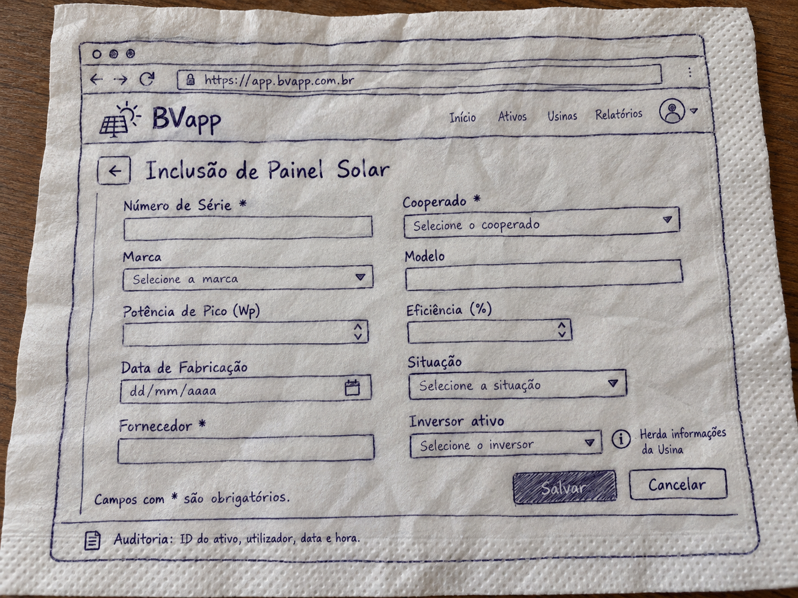
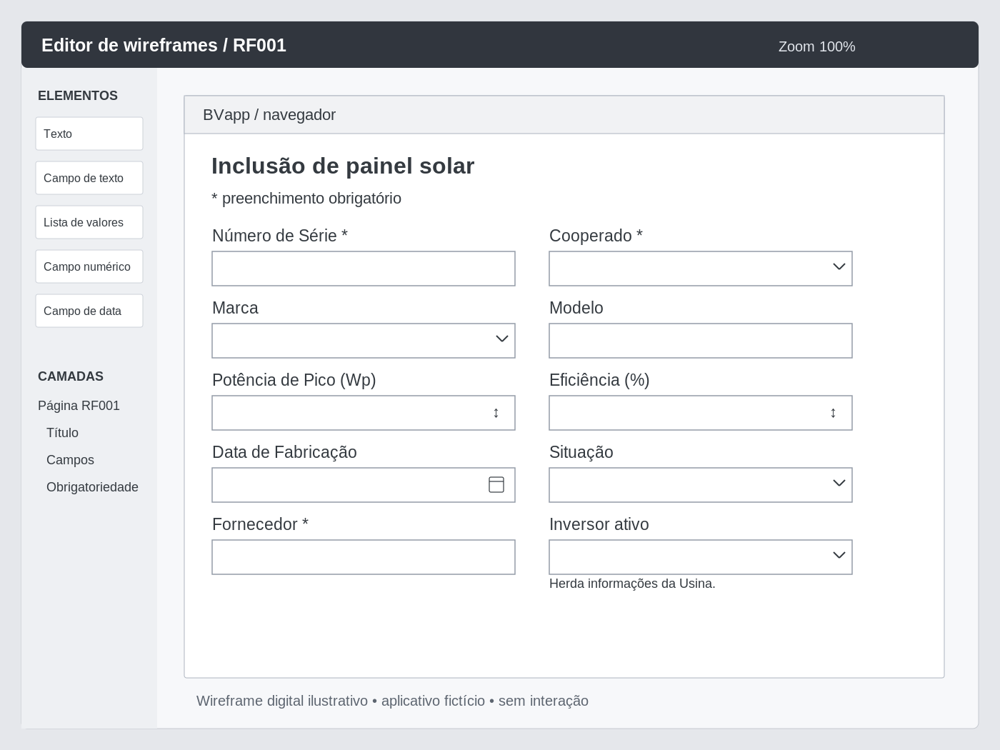
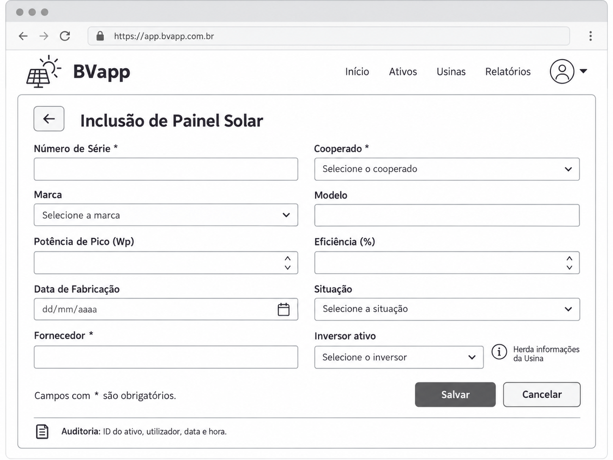
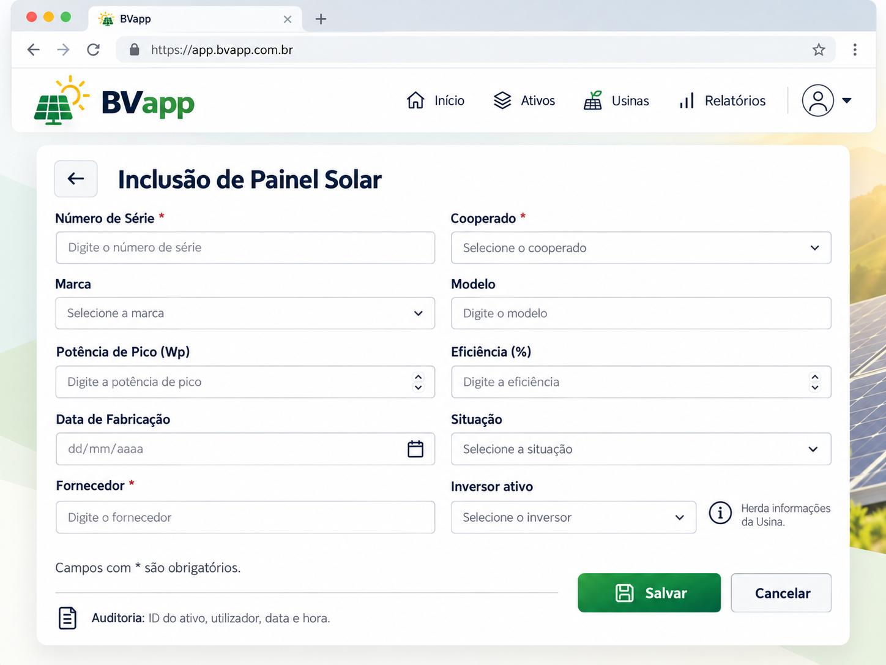

## O problema: transformar um requisito em comportamento verificável

> "Software é uma das construções humanas mais complexas." [@engsoftmoderna, cap. 8, introdução]

Na Aula 05, a proposta foi conduzir uma mini-RTF sobre um recorte dos requisitos do próprio projeto BVapp. O guia orientava cada grupo a localizar problemas, indicar a evidência e registrar o encaminhamento. Uma regra ausente deveria permanecer como questão a esclarecer, sem que o grupo inventasse uma resposta para concluir a revisão.

O mesmo cuidado será necessário ao escrever testes. Antes de executar o software, defina qual comportamento será observado e qual resultado permitirá julgá-lo. Se o requisito admite duas interpretações incompatíveis, escrever um teste para uma delas não resolve a divergência. A expectativa precisa ter uma base de referência identificável.

A revisão pode encontrar uma contradição no requisito sem executar o programa. Já o teste compara um resultado observado na execução com a expectativa adotada. Ao passar da mini-RTF para o desenvolvimento dirigido por testes, continuaremos usando os requisitos e as decisões registradas para justificar essa expectativa. A revisão e a execução de testes se complementam nas atividades de verificação e validação [@pressman2016, cap. 22, seção 22.1.1].

A demonstração desta sequência usa a Feature **24258 — “2.1. Inclusão de novos painéis solares”**, pertencente à Epic **24189 — “2. Gestão de Painéis Solares”** do BVapp. A aplicação didática será criada do zero, em repositório separado, com Python, Django e Selenium; o ambiente e suas dependências serão gerenciados por `uv`. O backend existente não será copiado nem usado para determinar o comportamento esperado.

Nesta aula, o incremento se limita à apresentação da primeira página de inclusão de painel solar. O cenário de apresentação de RF001, descrito adiante, estabelece a meta desse incremento: acessar a página pelo navegador, identificar sua finalidade e encontrar os dez campos, seus tipos de controle, rótulos e indicações de obrigatoriedade. A apresentação da data conforme o país configurado também faz parte dessa expectativa, mas sua verificação permanece pendente até que a configuração e o modo de observação sejam definidos. A página ainda não cadastra um painel. Persistência, validação do preenchimento e demais regras de funcionamento serão desenvolvidas em incrementos posteriores.

Para acompanhar o método, os exemplos de [vermelho]{style="color: #d00000;"}–[verde]{style="color: #006400;"}–[refatorar]{style="color: #0066cc;"} demonstram um passo menor dentro desse incremento: partem de uma página com o título correto e acrescentam uma lista de Cooperado visível. O [Verde]{style="color: #006400;"} desse passo não encerra o cenário de apresentação. Os demais campos, rótulos e indicações de obrigatoriedade deverão ser desenvolvidos em novos pequenos passos; o teste mais abrangente permite reconhecer essas pendências sem exigir que tudo seja implementado de uma vez.

Ao final desse incremento, teremos uma página de entrada para o cadastro, não um cadastro concluído. Mantenha essa diferença nos registros: os critérios que ainda não foram exercitados continuam pendentes. O recorte permite estudar o método em um comportamento pequeno; ele não elimina as demais obrigações da Feature.

## Objetivos de aprendizagem

Ao final desta aula, a pessoa estudante deverá ser capaz de:

- **relacionar um comportamento observável a um requisito** e reconhecer divergências que exigem decisão antes do teste;
- **descrever um caso de teste** com preparação, ação, resultado esperado e asserções;
- **explicar por que o teste deve falhar** antes da implementação e reconhecer o motivo dessa falha;
- **distinguir o teste funcional externo dos testes internos** que orientam a implementação;
- **explicar o ciclo [vermelho]{style="color: #d00000;"}–[verde]{style="color: #006400;"}–[refatorar]{style="color: #0066cc;"}** e o papel da regressão;
- **delimitar o que os resultados da suíte permitem concluir** e o que ainda não foi verificado.

## O contrato e os requisitos de origem

### Verificação estática realizada

Vamos analisar um dos requisitos criados por vocês.

**O backlog contém uma divergência**: o critério **2.1.1.1. CA01**, ID **24482**, declara Cooperado opcional; a user story **2.1.2**, ID **24495**, exige os vínculos com Fornecedor, Inversor e Cooperado no registro completo. Decidimos adotar nesta sequência, **Cooperado como campo obrigatório no contrato**.

> **Ainda sobre a origem da regra junto ao teste**: Preserve os textos de origem. A decisão permite desenvolver um comportamento definido, mas não apaga a divergência encontrada no *backlog*.

Esse é um uso direto do trabalho da mini-RTF. Se um teste aceitar o cadastro sem Cooperado e outro exigir a rejeição do mesmo cadastro, com as mesmas condições, a suíte terá expectativas incompatíveis. Antes de implementar, confira a base de referência e esclareça qual regra deve orientar os testes. Neste caso, para fins de prática discente, a decisão já foi tomada e deve permanecer rastreável.

**O contrato do primeiro incremento trata somente da apresentação da página**. A indicação visual de obrigatoriedade não demonstra que o servidor rejeita uma submissão sem Cooperado. Essa rejeição e a persistência do vínculo precisam de testes próprios nos próximos encontros.

### Inventário de aceitação

A tabela mantém a identificação original das subseções **2.1.1.1–2.1.1.9**. Os rótulos passam de CA04 para CA06. Preserve essa numeração para localizar cada critério na fonte; não vamos criar um CA05 para preencher a sequência, pois ela pode ter sido excluída em análises anteriores. As descrições abaixo sintetizam o *backlog*, nos trechos “2.1.1. CA — Inclusão de painéis solares” e “2.1.2. US — Registro Completo de Painel Solar”.

| Subseção e rótulo original | ID | Obrigação de origem | 
|---|---|---|
| 2.1.1.1. CA01 | 24482 | Exigir Número de Série, Marca, Modelo, Potência de Pico (Wp), Eficiência (%), Data de Fabricação, Situação, Fornecedor e Inversor; disponibilizar Cooperado como opcional no documento original |
| 2.1.1.2. CA02 | 24483 | Impedir gravação com campo obrigatório vazio e apresentar alerta específico |
| 2.1.1.3. CA03 | 24484 | Listar fabricantes de painéis ativos em ordem alfabética |
| 2.1.1.4. CA04 | 24485 | Filtrar Modelo pela Marca selecionada |
| 2.1.1.5. CA06 | 24488 | Permitir seleção de Inversor ativo e herdar automaticamente sua Usina |
| 2.1.1.6. CA07 | 24489 | Após persistência, exibir “Painel solar cadastrado com sucesso”; no documento original, complementar com o vínculo ao Cooperado quando informado |
| 2.1.1.7. CA08 | 24490 | Tornar obrigatória a seleção de Fornecedor |
| 2.1.1.8. CA09 | 24491 | Conectar o painel a um Inversor e disponibilizar a listagem de inversores ativos |
| 2.1.1.9. CA10 | 24492 | Registrar auditoria com ID do ativo, utilizador, data e hora |

Começar pela página permite acompanhar o ciclo de desenvolvimento sem implementar, de uma vez, cadastros auxiliares, persistência, filtros e auditoria. Quando esses comportamentos forem desenvolvidos, seus testes deverão usar as regras correspondentes. Não escolha limites numéricos ou outras restrições de domínio que o requisito não informou.

Ainda sobre o contrato acima, poderíamos descrever os requisitos da página inicial de outra maneira. Não é obrigatório, mas gostaria que você observasse como esse "contrato" poderia ser descrito:

> **[RF001]** - Como pessoa usuária do BVapp, gostaria de acessar, pelo navegador, a página de inclusão de painel solar, para que eu possa identificar onde iniciar o cadastro e quais informações fornecer neste primeiro incremento. A página deve identificar sua finalidade como inclusão de painel solar e apresentar os campos solicitados: 
>
> - Número de Série* (campo de texto)
> - Cooperado* (lista de valores)
> - Marca (lista de valores)
> - Modelo (campo de texto)
> - Potência de Pico (Wp) (campo de número)
> - Eficiência (%) (campo de número)
> - Data de Fabricação (campo de data)
> - Situação (lista de valores) 
> - Fornecedor* (campo de texto)  
> - Inversor ativo (lista de valores). Herda informações da Usina.
>
> Cada campo deve apresentar seu controle de entrada e identificação correspondente. Registrar auditoria com ID do ativo, utilizador, data e hora. Campos com * indicam que são obrigatórios. Os campos de data devem ser apresentados de acordo com os padrões de data do país configurado no sistema.

Essa redação segue o formato usado no material de requisitos funcionais: identificador, papel da pessoa usuária, funcionalidade desejada e finalidade, seguidos dos detalhes do comportamento esperado [@amaralRequisitosSCGP2023, seção "Requisitos funcionais"]. O identificador **[RF001]** é local a este exemplo didático; não substitui os IDs do backlog.

Na redação de RF001, distinguimos a apresentação da página das obrigações complementares de funcionamento. Os dez campos, seus controles, identificações, indicações de obrigatoriedade e apresentação localizada da data compõem o cenário de apresentação deste incremento. A herança de informações da Usina exige selecionar um Inversor e observar o resultado dessa ação; a auditoria exige realizar uma inclusão e consultar seu registro. Essas duas obrigações permanecem em RF001 para manter sua rastreabilidade, mas não são atendidas apenas pela abertura da página nem integram o passo demonstrado nesta aula. Adiante, elas aparecem em cenários próprios, com as lacunas do contrato e as verificações pendentes explicitadas.

Ainda assim, podemos agregar mais informações ao requisito funcional adicionando um protótipo da interface visual, podendo ser wireframe ou mock-up.

As três figuras a seguir são propostas didáticas elaboradas a partir da versão de RF001 apresentada acima. Elas mantêm os mesmos dez campos e a indicação de obrigatoriedade em Número de Série, Cooperado e Fornecedor. A disposição em duas colunas é uma escolha deste exemplo, não uma regra acrescentada ao requisito. Nenhuma das figuras é uma tela funcional do BVapp.

**Wireframe desenhado em um guardanapo**

{#fig-rf001-guardanapo fig-alt="Rascunho ilustrativo em guardanapo da página Inclusão de painel solar, com dez campos e asteriscos em Número de Série, Cooperado e Fornecedor." width="100%"}

Imagine que, durante a conversa sobre o requisito, alguém desenhe a página em um guardanapo. Nesse momento, queremos discutir o que aparece na tela e como a pessoa usuária identifica as informações solicitadas. Não precisamos escolher cores, tipografia ou acabamento. No exemplo, os retângulos representam os controles de entrada; as pequenas setas distinguem as listas de valores, e os asteriscos marcam os campos obrigatórios.

Esse rascunho permite apontar diretamente para uma parte da proposta: o nome Cooperado está claro? A indicação de obrigatoriedade aparece junto ao campo? A informação herdada da Usina está compreensível? Podemos riscar, mover ou acrescentar uma anotação enquanto discutimos. Sua utilidade está nessa conversa inicial, com pouco investimento no desenho. A imagem é uma ilustração de um rascunho em guardanapo, não uma fotografia de um artefato real.

**Wireframe desenhado em aplicativo de computador**

{#fig-rf001-computador fig-alt="Editor fictício de wireframes com uma página de inclusão de painel solar, dez campos e controles de texto, lista, número e data." width="100%"}

{#fig-rf001-computador-2 fig-alt="Editor fictício de wireframes com uma página de inclusão de painel solar, dez campos e controles de texto, lista, número e data." width="100%"}

No wireframe digital, a estrutura fica mais regular. Podemos examinar o alinhamento dos rótulos, o espaço ocupado pelos controles e a ordem de leitura sem discutir ainda a identidade visual do produto. O exemplo mostra uma interface fictícia de edição, com elementos e camadas; não é uma captura de um aplicativo comercial específico.

Essa representação é útil para revisar e compartilhar uma proposta depois da conversa inicial. Ao confrontá-la com RF001, podemos conferir se cada campo aparece com o tipo de controle solicitado: Cooperado e Marca como listas, Modelo e Fornecedor como entradas de texto, Potência de Pico e Eficiência como entradas numéricas e Data de Fabricação como entrada de data. O desenho também registra dúvidas para revisão. Por exemplo, a nota de Inversor ativo informa a herança de Usina, mas não define quais valores estarão disponíveis nem como essa herança ocorrerá.

**Mockup com acabamento profissional**

{#fig-rf001-mockup fig-alt="Proposta visual estática da página Inclusão de painel solar, em branco e verde, com dez campos e indicação textual de obrigatoriedade." width="100%"}

O mockup acrescenta decisões de apresentação: cores, tipografia, bordas e espaçamentos. Aqui, podemos discutir a aparência proposta e a facilidade de localizar o título, os rótulos e as indicações de obrigatoriedade. O acabamento ajuda a pessoa que revisa a imaginar a interface, mas também exige cuidado para que ela não interprete a figura como um cadastro já implementado. As cores e o estilo são escolhas ilustrativas, não uma identidade visual oficial do BVapp.

Embora tenha maior fidelidade visual, este mockup continua estático. Não permite abrir as listas, selecionar uma data ou verificar a rejeição de um campo obrigatório vazio. Também não comprova acessibilidade ou usabilidade: essas avaliações exigem critérios e evidências próprios. Não acrescentamos um botão de envio, pois a versão de RF001 usada nas figuras não especifica esse controle.

Nas três formas, o protótipo complementa a descrição textual. A exigência de auditoria com ID do ativo, utilizador, data e hora não foi transformada em campos do formulário, pois RF001 não solicita que a pessoa usuária informe esses dados na tela. Essa exigência continua no texto e precisa ser verificada quando o comportamento correspondente for desenvolvido. Da mesma forma, desenhar um asterisco não demonstra que a aplicação impede o envio sem preenchimento. Ao elaborar os testes, devemos distinguir o que foi combinado sobre a apresentação da página do que foi combinado sobre seu funcionamento.

As figuras abrangem todos os campos da redação atual de RF001 para permitir a comparação entre representações. 

Os protótipos ilustram a apresentação da página inicial. RF001 também registra as obrigações complementares de herança de Usina e auditoria, que não podem ser verificadas nessas imagens. Portanto, a conformidade visual com um protótipo não basta para declarar RF001 atendido, assim como a aprovação do pequeno passo de Cooperado não encerra o cenário de apresentação.

## TDD: o teste participa do desenvolvimento

No desenvolvimento dirigido por testes (*Test-Driven Development*, TDD):

1. Escreva o teste de um comportamento antes de implementar esse comportamento. 
2. Execute-o, examine a falha e faça a mudança necessária para que passe. 
3. Com os testes aprovados, avalie se há uma melhoria na organização do código que possa ser feita sem alterar o comportamento. 

![Ciclo [vermelho]{style="color: #d00000;"}-[verde]{style="color: #006400;"}-[refatorar]{style="color: #0066cc;"}](../../assets/images/06-introducao-tdd/infografico-ciclo-tdd.png){#fig-ciclo-tdd fig-alt="Infográfico do ciclo vermelho-verde-refatorar" width="100%"}

Essa sequência é o ciclo [vermelho]{style="color: #d00000;"}–[verde]{style="color: #006400;"}–[refatorar]{style="color: #0066cc;"}. Valente apresenta a prática na seção 8.7; Percival a desenvolve em pequenos passos na construção de uma aplicação web [@engsoftmoderna, seção 8.7; @percival2024early, caps. 1–4].

Escrever testes somente depois de uma funcionalidade pronta pode produzir evidências úteis, mas não reproduz a sequência de TDD. Nesta demonstração, o comportamento selecionado estará ausente na aplicação nova quando o teste for escrito.

### Onde ficam os exemplos no projeto

Os próximos blocos pertencem a uma aplicação Django didática, que será construída em um repositório separado deste material de aula. A árvore abaixo propõe onde colocar cada trecho quando essa aplicação for preparada. Ela é um mapa de localização, não um projeto já criado nem um roteiro de instalação.

```{.text}
bvapp-didatico/                         # repositório novo da aplicação
├── pyproject.toml                      # configuração e dependências com uv
├── uv.lock                             # dependências resolvidas pelo uv
├── manage.py                           # entrada dos comandos do Django
├── config/                             # configuração global do projeto
│   ├── __init__.py
│   ├── settings.py
│   ├── urls.py                          # associação de /paineis/novo/ à view
│   ├── asgi.py
│   └── wsgi.py
├── functional_tests/                   # observação pelo navegador
│   ├── __init__.py
│   └── test_rf001_inclusao_painel.py     # PaginaInclusaoPainelTest
│                                       # e CenariosRF001Test
└── paineis/                            # aplicação Django do recorte
    ├── __init__.py
    ├── apps.py
    ├── views.py                        # pagina_inclusao_painel
    ├── tests.py                        # RespostaInclusaoPainelTest
    └── templates/
        └── paineis/
            └── inclusao.html           # HTML extraído na refatoração
```

Essa organização adapta a separação usada por Percival: testes funcionais em `functional_tests/`, testes internos junto à aplicação e configuração global em outro pacote. No PDF adotado, o autor começa com um arquivo `functional_tests.py` e, no capítulo 6, o reorganiza como `functional_tests/tests.py`, com `__init__.py`. Aqui, adotamos desde o início o pacote de testes funcionais para situar os exemplos que usam o servidor de teste do Django. Dentro dele, reunimos os testes de inclusão de painel em `test_rf001_inclusao_painel.py`. O nome combina o identificador do requisito com uma descrição da funcionalidade; o uso de `RF001` é uma convenção desta disciplina para explicitar a rastreabilidade, não uma regra de nomenclatura atribuída a Percival. Portanto, não é uma reprodução literal da árvore dos primeiros capítulos: `config` e `paineis` são nomes didáticos próprios, a gestão por `uv` é uma decisão desta disciplina e o template recebe um subdiretório com o nome da aplicação [@percival2024early, caps. 3–4 e 6].

A árvore mostra os arquivos relevantes para acompanhar esta aula. Omite outros arquivos que poderão existir na preparação do projeto; não propõe modelos de domínio, migrações ou regras de persistência. `inclusao.html` aparece como destino da refatoração: no primeiro **[Verde]{style="color: #006400;"}**, o HTML ainda está dentro de `views.py`. A configuração deverá registrar a aplicação e permitir localizar seus templates quando o ambiente for preparado.

Os arquivos têm papéis diferentes: `functional_tests/test_rf001_inclusao_painel.py` contém os testes que abrem o navegador; `paineis/tests.py` contém o exemplo de teste interno da resposta Django. A localização ajuda a organizar a leitura, mas não determina, sozinha, o alcance de um teste.

| Exemplo da aula | Arquivo proposto | O que observa | Papel na sequência |
|---|---|---|---|
| `PaginaInclusaoPainelTest` | `functional_tests/test_rf001_inclusao_painel.py` | Página identificada e uma lista de Cooperado visível | Orientar o pequeno passo de **[Vermelho]{style="color: #d00000;"}**, **[Verde]{style="color: #006400;"}** e **[Refatorar]{style="color: #0066cc;"}** |
| `CenariosRF001Test` | `functional_tests/test_rf001_inclusao_painel.py` | Apresentação mais abrangente de RF001, com pendências explícitas | Traduzir a narrativa do requisito em verificações e mostrar o que ainda falta |
| `RespostaInclusaoPainelTest` | `paineis/tests.py` | Resposta da solicitação e HTML da lista | Orientar o passo interno explicado em **Dois ciclos na aplicação web** |

As duas primeiras classes pertencem ao **ciclo externo**: ambas usam Selenium para observar a página pelo navegador. `CenariosRF001Test` não é o teste interno de `PaginaInclusaoPainelTest`, não herda dela e não é chamada por ela. São exemplos de alcances diferentes sobre a mesma página. A expectativa de Cooperado aparece nas duas porque o pequeno passo também faz parte do cenário mais amplo. Quando os exemplos forem reunidos no arquivo proposto, os imports comuns poderão ficar uma única vez no início; sua repetição nos blocos permite ler cada exemplo separadamente.

No atendimento de `/paineis/novo/`, a configuração de URLs encaminha a solicitação à função `pagina_inclusao_painel`, em `paineis/views.py`. No primeiro **[Verde]{style="color: #006400;"}**, essa função devolve o HTML diretamente; depois da refatoração, renderiza `paineis/templates/paineis/inclusao.html`, identificado no código pelo nome `paineis/inclusao.html`. Os testes ficam em arquivos separados da implementação: verificam a resposta ou a página, mas não produzem o comportamento da aplicação.

### [Vermelho]{style="color: #d00000;"}

> [!tip]
> Os códigos abaixo são somente recortes de um passo maior.

Escreva a expectativa do próximo passo e execute o teste antes de mudar a implementação. Leia o resultado da execução. A falha precisa corresponder ao comportamento que ainda falta: a rota pode não atender à solicitação ou a página pode não apresentar o campo esperado, conforme o passo em desenvolvimento.

Suponha que a página já identifique a inclusão de painel, mas ainda não apresente o controle de Cooperado. O próximo teste deve verificar a presença desse controle. Se ele falhar porque não o encontrou, a falha corresponderá ao comportamento ausente. Se passar antes da mudança, confira se o controle já existe ou se a asserção deixou de verificar o que deveria. Não avance apenas porque a execução terminou sem erro.

O exemplo em Python abaixo transforma esse pequeno recorte de **RF001** em uma expectativa executável: a página deve apresentar Cooperado como uma lista de valores visível. O teste usa Django e Selenium. Para este exemplo, adotamos o endereço `/paineis/novo/` e um elemento HTML `select` com `name="cooperado"`. Esses identificadores são convenções propostas para a aplicação didática, não nomes de rota ou atributos já existentes no BVapp. O exemplo pressupõe que a página já pode ser acessada sem autenticação e que o ambiente de teste está configurado.

Na organização proposta, esta classe fica em `functional_tests/test_rf001_inclusao_painel.py`. `PaginaInclusaoPainelTest` é código de teste, não uma view ou um modelo de painel. A classe-base `StaticLiveServerTestCase` é fornecida pelo Django: disponibiliza um servidor temporário para a execução do teste, cujo endereço é acessado por `self.live_server_url`, e acrescenta suporte para servir arquivos estáticos. Em `setUp`, o exemplo abre o navegador; `addCleanup` registra seu encerramento mesmo se houver falha. A infraestrutura permite observar a página, mas são as asserções do método que expressam a expectativa de RF001 [@djangoTestingTools52, seção "LiveServerTestCase"].

```{.python}
# Arquivo: bvapp-didatico/functional_tests/test_rf001_inclusao_painel.py
from django.contrib.staticfiles.testing import StaticLiveServerTestCase
from selenium import webdriver
from selenium.webdriver.common.by import By


class PaginaInclusaoPainelTest(StaticLiveServerTestCase):
    def setUp(self):
        self.browser = webdriver.Chrome()
        self.addCleanup(self.browser.quit)

    def test_pagina_apresenta_lista_de_cooperados(self):
        # Preparação: acessar a página prevista neste exemplo.
        self.browser.get(f"{self.live_server_url}/paineis/novo/")
        titulo = self.browser.find_element(By.TAG_NAME, "h1")
        self.assertEqual(titulo.text, "Inclusão de painel solar")

        # Observação: procurar o controle definido para Cooperado.
        controles = self.browser.find_elements(
            By.CSS_SELECTOR, 'select[name="cooperado"]'
        )

        # Oráculo: a página deve apresentar uma lista visível.
        self.assertEqual(
            len(controles), 1,
            "RF001: a página deve apresentar a lista de Cooperado.",
        )
        self.assertTrue(
            controles[0].is_displayed(),
            "RF001: a lista de Cooperado deve estar visível.",
        )
```

A primeira asserção confirma a identificação da página que, neste passo, já deveria estar implementada. Em seguida, `find_elements` procura os controles que correspondem ao seletor. Se a página não tiver o controle de Cooperado, essa busca retorna uma lista vazia e a asserção sobre sua quantidade falha. O teste não chega à verificação de visibilidade, pois a execução do método é interrompida nessa asserção. Esse é o [vermelho]{style="color: #d00000;"} esperado para o cenário descrito: conseguimos observar a página, mas o controle exigido ainda está ausente.

Se o teste falhar antes, ao procurar o título ou ao comparar seu texto, ainda não temos evidência da ausência de Cooperado: precisamos investigar se a página correta foi carregada. Também não basta inserir a palavra “Cooperado” em qualquer lugar da página para aprovar o teste, pois o seletor procura um controle de lista. Este caso não verifica os valores disponíveis, a associação entre rótulo e controle, a indicação de obrigatoriedade ou a rejeição de um envio sem Cooperado. São expectativas distintas, que deverão receber seus próprios testes nos passos correspondentes. A falha descrita aqui é a esperada para o exemplo; não é um resultado de execução da aplicação didática.

Uma falha causada por navegador indisponível, dependência ausente ou servidor não iniciado não demonstra que falta o controle de Cooperado. Nesse caso, o teste sequer conseguiu observar a página nas condições previstas. Resolva o problema de infraestrutura e execute novamente antes de usar o resultado como evidência do ciclo. Registre o motivo observado, não apenas que “o teste falhou”.

### [Verde]{style="color: #006400;"}

Implemente o necessário para satisfazer a expectativa atual e execute o teste novamente. Se o passo exige apresentar o controle de Cooperado, a mudança deve atender a essa expectativa. A gravação de um painel e o registro de auditoria pertencem a outros comportamentos e continuarão pendentes.

Para o teste apresentado em **[Vermelho]{style="color: #d00000;"}**, a mudança está na resposta da página: preservar o título que já era esperado e acrescentar uma lista de Cooperado visível. O exemplo abaixo mostra uma função de apresentação (*view*) do Django que devolve esse HTML. Adotamos o nome `pagina_inclusao_painel` apenas para o exemplo e pressupomos que a rota `/paineis/novo/`, já acessível no passo anterior, esteja associada a essa função. Na aplicação didática, a alteração deve preservar os demais elementos e comportamentos que já tiverem sido implementados; o trecho mostra somente o recorte observado pelo teste.

```{.python}
# Arquivo: bvapp-didatico/paineis/views.py
from django.http import HttpResponse


def pagina_inclusao_painel(request):

    # Neste pequeno passo, o HTML fica diretamente na resposta
    # para tornar visível a mudança exigida pelo teste.
    # Na seção Refatorar, vamos extraí-lo para o template
    # paineis/templates/paineis/inclusao.html e usar diretamente
    # return render(request, "paineis/inclusao.html").
    # A extração deve preservar o comportamento observado pelos testes.

    return HttpResponse(
        """<!doctype html>
        <html lang="pt-BR">
          <head>
            <meta charset="utf-8">
            <title>Inclusão de painel solar</title>
          </head>
          <body>
            <h1>Inclusão de painel solar</h1>
            <label for="cooperado">Cooperado</label>
            <select id="cooperado" name="cooperado">
              <option value="">Selecione um cooperado</option>
            </select>
          </body>
        </html>"""
    )
```

Observe a relação com as asserções do teste anterior: o texto do elemento `h1` permanece “Inclusão de painel solar”; existe um único elemento que corresponde a `select[name="cooperado"]`; e esse elemento não foi ocultado. A opção inicial orienta o preenchimento, mas não inventa um Cooperado nem uma lista de registros. A associação entre `label` e `select` identifica o controle conforme RF001, embora o teste de **[Vermelho]{style="color: #d00000;"}** ainda não verifique essa associação.

Agora devemos executar novamente **o mesmo teste**, sem mudar seu seletor ou enfraquecer suas asserções para acomodar a implementação. Sob as condições de ambiente e acesso descritas em **[Vermelho]{style="color: #d00000;"}**, a expectativa é que ele passe. 

Esse [verde]{style="color: #006400;"} atende somente à apresentação da lista de Cooperado. Ainda não atende a RF001 por inteiro: faltam, entre outras expectativas, a indicação de obrigatoriedade e os valores disponíveis para seleção. Também não verificamos submissão, persistência ou auditoria. Manter o HTML diretamente na resposta permite enxergar a pequena mudança; uma possível extração para template será discutida em **[Refatorar]{style="color: #0066cc;"}**, sem alterar o comportamento observado pelo teste.

Trabalhar em pequenos passos permite relacionar a mudança ao resultado da execução. Ao implementar várias responsabilidades de uma vez, fica mais difícil explicar qual delas corrigiu a falha e quais ainda não têm teste. Neste incremento, mantenha o trabalho na resposta à solicitação e na apresentação da página definida pelo recorte.

“Implementação mínima” significa limitar a mudança ao comportamento exigido pelo teste. Não remova uma asserção relevante para obter aprovação nem faça a aplicação depender de dados ocultos no teste. Se descobrir um erro na expectativa, corrija-o com base no contrato e registre o motivo. Alterar o teste para aceitar uma implementação incorreta deixa de verificar o comportamento escolhido.

### [Refatorar]{style="color: #0066cc;"}

Com os testes aprovados, examine a organização do código. Uma responsabilidade de apresentação que começou diretamente na resposta pode, por exemplo, ser deslocada para um template. Nessa mudança, a página deve continuar identificando a inclusão de painel e preservando os controles e as indicações que já tiverem sido implementados. O que muda é a organização da implementação.

No exemplo de **[Verde]{style="color: #006400;"}**, a função `pagina_inclusao_painel` contém tanto a resposta à solicitação quanto o HTML da página. Podemos separar esse HTML para facilitar a manutenção da apresentação sem misturá-la ao código Python. A função mantém o mesmo nome e a mesma associação com `/paineis/novo/`, mas passa a solicitar a renderização de um template:

```{.python}
# Arquivo: bvapp-didatico/paineis/views.py
from django.shortcuts import render


def pagina_inclusao_painel(request):
    return render(request, "paineis/inclusao.html")
```

Neste exemplo, `paineis/inclusao.html` é um nome proposto para o template, não um arquivo já existente no BVapp. O arquivo deve estar em um diretório reconhecido pelo carregador de templates configurado no Django. Seu conteúdo é o HTML retirado de **[Verde]{style="color: #006400;"}**, preservando os elementos observados pelo teste de **[Vermelho]{style="color: #d00000;"}**:

```{.html}
<!-- Arquivo: bvapp-didatico/paineis/templates/paineis/inclusao.html -->
<!doctype html>
<html lang="pt-BR">
  <head>
    <meta charset="utf-8">
    <title>Inclusão de painel solar</title>
  </head>
  <body>
    <h1>Inclusão de painel solar</h1>
    <label for="cooperado">Cooperado</label>
    <select id="cooperado" name="cooperado">
      <option value="">Selecione um cooperado</option>
    </select>
  </body>
</html>
```

O atalho `render` já devolve um objeto `HttpResponse` com o conteúdo renderizado, conforme a [documentação do Django sobre funções de atalho](https://docs.djangoproject.com/en/5.2/topics/http/shortcuts/#render). Portanto, nesta versão, usamos diretamente `return render(...)`, sem envolver o resultado em `HttpResponse(render(...))`. Não precisamos introduzir React ou outra biblioteca de frontend para realizar essa extração.

O teste de **[Vermelho]{style="color: #d00000;"}** continua sem alterações: acessa a mesma URL, procura o mesmo título e verifica uma lista de Cooperado visível pelo seletor `select[name="cooperado"]`. Ele observa a página pelo navegador e não depende de o HTML estar em uma string Python ou em um template. Execute-o antes e depois da extração. Se o Django não encontrar o template, ou se algum elemento desaparecer, investigue a regressão antes de prosseguir; não altere o teste para aceitar a perda do comportamento.

A refatoração mantém o mesmo recorte de RF001 atendido em **[Verde]{style="color: #006400;"}**. Não acrescentamos registros de Cooperado, obrigatoriedade, gravação ou auditoria. Acrescentar uma dessas expectativas exige outro passo de desenvolvimento, com uma nova falha esperada antes da implementação. Aqui, a melhoria pretendida é separar a apresentação da função que produz a resposta, preservando o comportamento existente.

Justifique a refatoração pelo problema que ela resolve. Extrair a apresentação para um template é uma possibilidade didática; não é uma etapa obrigatória em todo ciclo. Se não houver uma melhoria justificada, não faça uma alteração estrutural apenas para demonstrar a terceira etapa.

Execute novamente a suíte pertinente após a mudança. Confira se os testes que passavam continuam aprovados, incluindo a expectativa externa da página. Esses resultados oferecem evidência sobre os comportamentos verificados. Eles não provam que qualquer alteração no programa seja segura nem cobrem comportamentos para os quais ainda não há testes [@engsoftmoderna, seção 8.7; @percival2024early, caps. 3–4].

## Caso de teste, oráculo e asserção

Vamos traduzir o cenário de apresentação de RF001 em um caso de teste e em asserções. Essa tradução registra o que deverá ser observado; não significa que o requisito inteiro já foi desenvolvido ou verificado. O pequeno passo de Cooperado continua sendo a demonstração do ciclo, enquanto o cenário mais abrangente explicita o que ainda precisa ser desenvolvido e as obrigações complementares permanecem pendentes.

Um caso de teste descreve em quais condições o teste será executado, qual ação será realizada e qual resultado se espera. A preparação deve permitir repetir a observação sem depender de condições que não foram registradas. Nesta aula, por exemplo, a aplicação precisa estar em execução e o navegador deve estar disponível, mas não é necessário ter um painel salvo para observar a página inicial.

O **oráculo de teste** é a referência ou o mecanismo que usamos para decidir se o resultado observado corresponde ao resultado esperado. Executar a aplicação permite observar o que ela fez; isso, por si só, não informa se ela fez o que deveria. Para julgar o resultado, precisamos de uma expectativa justificada. Ela pode ser estabelecida por um requisito, uma regra de negócio ou uma decisão registrada no contrato de aceitação. Neste exemplo, RF001 e o contrato didático fornecem essa referência. O oráculo não precisa ser outro programa: uma pessoa também pode comparar o comportamento observado com o que foi especificado.

Considere a lista de Cooperado. RF001 estabelece que a página deve apresentar esse controle; portanto, encontrar apenas o título da página não basta para considerar essa parte do requisito atendida. No teste da seção **[Vermelho]{style="color: #d00000;"}**, traduzimos a expectativa em uma verificação de que existe uma lista visível. O resultado observado é o que o navegador encontra na página; o resultado esperado vem do requisito. Já o seletor `select[name="cooperado"]` é uma convenção do exemplo para localizar o controle, não a fonte que justifica sua presença.

Para a indicação de obrigatoriedade de Cooperado, o oráculo se apoia na decisão registrada no contrato e incorporada ao requisito. Ao revisar a página, devemos comparar a indicação que ela apresenta com essa expectativa. Uma indicação visível pode atender à expectativa de apresentação, mas não demonstra que a aplicação rejeita um cadastro sem Cooperado. Essa rejeição é outro comportamento e exige um caso de teste próprio. Assim, o oráculo precisa corresponder ao que cada caso pretende verificar: mostrar que um campo é obrigatório e impedir um envio sem preenchimento não são o mesmo resultado.

Também não devemos adotar como resultado esperado aquilo que a implementação acabou de produzir apenas porque ela executou sem erro. Isso faria o teste confirmar o próprio comportamento do código, mesmo que ele estivesse incorreto. Se o requisito estiver ambíguo ou houver decisões conflitantes, precisamos esclarecer a expectativa antes de usar a execução para concluir que houve conformidade. 

A **asserção** expressa uma verificação concreta no código de teste: ela compara o que o teste observou com o que deveria encontrar. O requisito justifica a expectativa; a asserção verifica uma parte observável dela. 

Essa organização do caso é uma síntese didática apoiada na discussão de requisitos e testes dos autores [@pressman2016, cap. 22; @engsoftmoderna, seção 8.2; @percival2024early, caps. 1–2].

O cenário de apresentação pode ser descrito sem escolher ainda URLs, seletores ou nomes de classes. O quadro abaixo contempla todos os campos da redação atual de RF001; os exemplos de **[Vermelho]{style="color: #d00000;"}**, **[Verde]{style="color: #006400;"}** e **[Refatorar]{style="color: #0066cc;"}** continuam sendo passos menores para desenvolver esse cenário:

| Elemento | Definição para o primeiro incremento |
|---|---|
| Preparação | Aplicação didática em execução e navegador disponível para o teste; nenhuma persistência de painel é necessária |
| Ação | Acessar a página de inclusão de painel solar |
| Resultado esperado | A página identifica a inclusão de painel e apresenta os dez campos de RF001, com seus tipos de controle e identificações; indica a obrigatoriedade de Número de Série, Cooperado e Fornecedor e apresenta Data de Fabricação conforme o padrão do país configurado |
| Asserções | Verificar a identificação da página, cada controle e sua identificação, as três indicações de obrigatoriedade e a apresentação de data conforme a configuração do sistema |
| Fora do alcance | Submissão, gravação, rejeição de dados incompletos, filtros, herança de Usina, mensagem de sucesso e auditoria |

Podemos transformar esse quadro em uma narrativa de uso escrita em comentários Python. Seguindo a abordagem de Percival, descrevemos primeiro o percurso da pessoa usuária e o que ela espera encontrar; depois, acrescentamos as ações e as asserções do teste junto aos comentários correspondentes [@percival2024early, cap. 2]. O bloco abaixo foi elaborado para RF001. Ele não reproduz o exemplo do livro nem escolhe ainda URLs, seletores ou nomes de classes. Além da apresentação, registra cenários complementares para a herança de Usina e a auditoria, sem tratá-los como comportamentos já implementados no primeiro passo.

```{.python}
# Arquivo: bvapp-didatico/functional_tests/test_rf001_inclusao_painel.py
# Cenário: observar a página inicial de inclusão de painel solar.
# Referência: redação atual de RF001 e contrato didático.
#
# A aplicação didática está em execução e há um navegador disponível
# para o teste. Não é necessário cadastrar ou salvar um painel
# para observar esta página.
# O país configurado no sistema e seu padrão de data são conhecidos
# na preparação do teste, sem presumir um país ou formato específico.
#
# Uma pessoa usuária quer conhecer a página em que poderá iniciar
# a inclusão de um painel solar. Ela acessa essa página no navegador.
#
# Ao abrir a página, ela encontra uma identificação visível de que
# está na página de inclusão de painel solar.
# O teste deverá verificar essa identificação, não apenas confirmar
# que a aplicação respondeu à solicitação.
#
# Ela encontra o campo Número de Série, com um controle de texto
# visível e identificado para informar o número de série do painel.
# O teste deverá verificar o controle correspondente ao campo;
# encontrar somente as palavras "Número de Série" não será suficiente.
#
# Ela também encontra o campo Cooperado, apresentado como uma lista
# visível e identificada para a seleção de um cooperado.
# O teste deverá verificar esse controle, não apenas a presença
# da palavra "Cooperado" em algum lugar da página.
#
# Ela encontra Marca como uma lista de valores e Modelo como
# um campo de texto, ambos visíveis e identificados.
# O teste deverá verificar cada controle e sua identificação.
#
# Ela encontra Potência de Pico (Wp) e Eficiência (%) como campos
# numéricos, visíveis e identificados com as unidades correspondentes.
# O teste deverá verificar os dois controles e suas identificações,
# sem acrescentar limites numéricos que RF001 não definiu.
#
# Ela encontra Data de Fabricação como um campo de data.
# O teste deverá verificar o controle, sua identificação e a forma
# de apresentação da data conforme o país configurado no sistema.
# Não basta verificar que o controle existe para concluir
# que sua apresentação respeita essa configuração.
#
# Ela encontra Situação como uma lista de valores, Fornecedor como
# um campo de texto e Inversor ativo como uma lista de valores.
# O teste deverá verificar cada controle visível e sua identificação.
# Não presumimos opções específicas para as listas que RF001
# não enumerou, nem trocamos Fornecedor por uma lista de valores.
#
# Junto a Número de Série, Cooperado e Fornecedor, ela encontra
# a indicação de que os três campos são obrigatórios.
# O teste deverá verificar essas indicações conforme RF001.
# Nesta redação, o asterisco identifica os campos obrigatórios;
# não estendemos essa marcação aos demais campos por suposição.
#
# Com essas observações, ela reconhece a finalidade da página,
# encontra os dez controles previstos em RF001 e reconhece
# a obrigatoriedade de Número de Série, Cooperado e Fornecedor.
# O cenário termina aqui, sem preencher ou submeter o formulário.
#
# Este cenário não verifica gravação, rejeição de dados incompletos,
# filtros, herança de Usina, mensagem de sucesso ou auditoria.
# A indicação visual de obrigatoriedade não comprova que a aplicação
# rejeitará uma submissão sem Cooperado: isso exige outro cenário.
#
# Cenário complementar: herdar informações da Usina pelo Inversor.
# Este comportamento não é verificado apenas ao abrir a página.
#
# Para este teste, há um Inversor ativo disponível e sua Usina
# associada é conhecida. Os dados de preparação registram
# as informações dessa Usina que devem ser herdadas.
# A pessoa usuária seleciona esse Inversor na lista correspondente.
# O teste deverá verificar que as informações herdadas correspondem
# à Usina associada ao Inversor selecionado.
# RF001 não enumera essas informações nem como serão apresentadas:
# esclarecemos esses detalhes antes de escrever as asserções concretas.
# Não inventamos campos de Usina nem valores esperados.
#
# Cenário complementar: registrar a auditoria da inclusão.
# Este comportamento exige realizar a inclusão, não apenas ver a página.
#
# Para este teste, são conhecidos o utilizador responsável e os dados
# necessários para realizar uma inclusão válida. A forma de realizar
# e confirmar a inclusão deverá estar definida no contrato de teste.
# Após a inclusão, o ID do ativo criado está disponível para comparação.
# O teste deverá verificar o registro de auditoria correspondente,
# contendo o ID desse ativo, o utilizador responsável, a data e a hora.
# A preparação deverá permitir conferir data e hora de forma repetível,
# sem presumir um fuso, formato ou tolerância que não foi definido.
# Esses dados não são campos que a pessoa precisa digitar no formulário.
# O meio de consultar a auditoria deverá ser definido antes de implementar
# o teste; RF001 não especifica uma tela ou uma API para essa consulta.
```

Este bloco contém apenas comentários: ele documenta o cenário, mas não executa ações nem verifica resultados.

A seguir, mantemos os mesmos comentários e acrescentamos o código de teste. Usamos a URL didática já proposta e adotamos nomes de controles apenas para este exemplo: `numero_serie`, `cooperado`, `marca`, `modelo`, `potencia_pico`, `eficiencia`, `data_fabricacao`, `situacao`, `fornecedor` e `inversor`. Cada controle deve ter um `id` e um rótulo visível associado por `label[for]`. O asterisco deve aparecer no rótulo dos três campos obrigatórios. Essas são convenções de implementação do exemplo, não nomes extraídos do backend existente. Outra estrutura de interface exigiria adaptar os localizadores, sem alterar as expectativas de RF001.

O teste de apresentação abaixo verifica os dez controles, seus tipos, os rótulos e os asteriscos. A apresentação localizada da data fica em um teste separado e explicitamente ignorado, pois ainda precisamos definir a configuração do país e como observar o formato na interface. Herança de Usina e auditoria também ficam marcadas com `@skip`: seus comentários são preservados, mas não substituímos os contratos ausentes por modelos, consultas ou valores inventados. Um teste ignorado não é um teste aprovado nem evidencia atendimento ao requisito.

`CenariosRF001Test` também pertence a `functional_tests/test_rf001_inclusao_painel.py` e usa a mesma infraestrutura externa de Django e Selenium. Aqui, a finalidade é mostrar a tradução da narrativa mais abrangente em código, não substituir o pequeno teste de **[Vermelho]{style="color: #d00000;"}** nem implementar todos os campos de uma só vez. Contra a implementação mínima de **[Verde]{style="color: #006400;"}**, o teste de apresentação ainda deve falhar por campos ausentes, mesmo que `PaginaInclusaoPainelTest` já passe. Leia essa diferença como uma pendência do cenário mais amplo; não como autorização para ampliar o passo atual ou enfraquecer suas asserções.

```{.python}
# Arquivo: bvapp-didatico/functional_tests/test_rf001_inclusao_painel.py
from unittest import skip

from django.contrib.staticfiles.testing import StaticLiveServerTestCase
from selenium import webdriver
from selenium.webdriver.common.by import By


class CenariosRF001Test(StaticLiveServerTestCase):
    def setUp(self):
        self.browser = webdriver.Chrome()
        self.addCleanup(self.browser.quit)

    def test_apresentacao_da_pagina(self):
        # Cenário: observar a página inicial de inclusão de painel solar.
        # Referência: redação atual de RF001 e contrato didático.
        #
        # A aplicação didática está em execução e há um navegador disponível
        # para o teste. Não é necessário cadastrar ou salvar um painel
        # para observar esta página.
        # O país configurado no sistema e seu padrão de data são conhecidos
        # na preparação do teste, sem presumir um país ou formato específico.
        #
        # Uma pessoa usuária quer conhecer a página em que poderá iniciar
        # a inclusão de um painel solar. Ela acessa essa página no navegador.
        self.browser.get(f"{self.live_server_url}/paineis/novo/")

        #
        # Ao abrir a página, ela encontra uma identificação visível de que
        # está na página de inclusão de painel solar.
        # O teste deverá verificar essa identificação, não apenas confirmar
        # que a aplicação respondeu à solicitação.
        titulos = self.browser.find_elements(By.TAG_NAME, "h1")
        self.assertEqual(len(titulos), 1)
        self.assertTrue(titulos[0].is_displayed())
        self.assertEqual(titulos[0].text, "Inclusão de painel solar")

        #
        # Ela encontra o campo Número de Série, com um controle de texto
        # visível e identificado para informar o número de série do painel.
        # O teste deverá verificar o controle correspondente ao campo;
        # encontrar somente as palavras "Número de Série" não será suficiente.
        controles = self.browser.find_elements(By.NAME, "numero_serie")
        self.assertEqual(len(controles), 1, "RF001: controle numero_serie ausente ou duplicado.")
        serie = controles[0]
        self.assertTrue(serie.is_displayed())
        self.assertEqual(serie.tag_name, "input")
        self.assertEqual(serie.get_property("type"), "text")

        #
        # Ela também encontra o campo Cooperado, apresentado como uma lista
        # visível e identificada para a seleção de um cooperado.
        # O teste deverá verificar esse controle, não apenas a presença
        # da palavra "Cooperado" em algum lugar da página.
        controles = self.browser.find_elements(By.NAME, "cooperado")
        self.assertEqual(len(controles), 1)
        cooperado = controles[0]
        self.assertTrue(cooperado.is_displayed())
        self.assertEqual(cooperado.tag_name, "select")

        #
        # Ela encontra Marca como uma lista de valores e Modelo como
        # um campo de texto, ambos visíveis e identificados.
        # O teste deverá verificar cada controle e sua identificação.
        controles = self.browser.find_elements(By.NAME, "marca")
        self.assertEqual(len(controles), 1)
        marca = controles[0]
        self.assertTrue(marca.is_displayed())
        self.assertEqual(marca.tag_name, "select")

        controles = self.browser.find_elements(By.NAME, "modelo")
        self.assertEqual(len(controles), 1)
        modelo = controles[0]
        self.assertTrue(modelo.is_displayed())
        self.assertEqual(modelo.tag_name, "input")
        self.assertEqual(modelo.get_property("type"), "text")

        #
        # Ela encontra Potência de Pico (Wp) e Eficiência (%) como campos
        # numéricos, visíveis e identificados com as unidades correspondentes.
        # O teste deverá verificar os dois controles e suas identificações,
        # sem acrescentar limites numéricos que RF001 não definiu.
        controles = self.browser.find_elements(By.NAME, "potencia_pico")
        self.assertEqual(len(controles), 1)
        potencia = controles[0]
        self.assertTrue(potencia.is_displayed())
        self.assertEqual(potencia.tag_name, "input")
        self.assertEqual(potencia.get_property("type"), "number")

        controles = self.browser.find_elements(By.NAME, "eficiencia")
        self.assertEqual(len(controles), 1)
        eficiencia = controles[0]
        self.assertTrue(eficiencia.is_displayed())
        self.assertEqual(eficiencia.tag_name, "input")
        self.assertEqual(eficiencia.get_property("type"), "number")

        #
        # Ela encontra Data de Fabricação como um campo de data.
        # O teste deverá verificar o controle, sua identificação e a forma
        # de apresentação da data conforme o país configurado no sistema.
        # Não basta verificar que o controle existe para concluir
        # que sua apresentação respeita essa configuração.
        controles = self.browser.find_elements(By.NAME, "data_fabricacao")
        self.assertEqual(len(controles), 1)
        data_fabricacao = controles[0]
        self.assertTrue(data_fabricacao.is_displayed())
        self.assertEqual(data_fabricacao.tag_name, "input")
        self.assertEqual(data_fabricacao.get_property("type"), "date")

        #
        # Ela encontra Situação como uma lista de valores, Fornecedor como
        # um campo de texto e Inversor ativo como uma lista de valores.
        # O teste deverá verificar cada controle visível e sua identificação.
        # Não presumimos opções específicas para as listas que RF001
        # não enumerou, nem trocamos Fornecedor por uma lista de valores.
        controles = self.browser.find_elements(By.NAME, "situacao")
        self.assertEqual(len(controles), 1)
        situacao = controles[0]
        self.assertTrue(situacao.is_displayed())
        self.assertEqual(situacao.tag_name, "select")

        controles = self.browser.find_elements(By.NAME, "fornecedor")
        self.assertEqual(len(controles), 1)
        fornecedor = controles[0]
        self.assertTrue(fornecedor.is_displayed())
        self.assertEqual(fornecedor.tag_name, "input")
        self.assertEqual(fornecedor.get_property("type"), "text")

        controles = self.browser.find_elements(By.NAME, "inversor")
        self.assertEqual(len(controles), 1)
        inversor = controles[0]
        self.assertTrue(inversor.is_displayed())
        self.assertEqual(inversor.tag_name, "select")

        ## O código abaixo verifica se os rótulos dos controles estão corretos.

        rotulos_por_campo = {}
        for controle, texto_esperado in (
            (serie, "Número de Série"),
            (cooperado, "Cooperado"),
            (marca, "Marca"),
            (modelo, "Modelo"),
            (potencia, "Potência de Pico (Wp)"),
            (eficiencia, "Eficiência (%)"),
            (data_fabricacao, "Data de Fabricação"),
            (situacao, "Situação"),
            (fornecedor, "Fornecedor"),
            (inversor, "Inversor ativo"),
        ):
            identificador = controle.get_dom_attribute("id")
            self.assertTrue(identificador)
            rotulos = self.browser.find_elements(By.CSS_SELECTOR, f'label[for="{identificador}"]')
            self.assertEqual(len(rotulos), 1)
            rotulo = rotulos[0]
            self.assertTrue(rotulo.is_displayed())
            self.assertEqual(rotulo.text.replace("*", "").strip(), texto_esperado)
            rotulos_por_campo[texto_esperado] = rotulo

        #
        # Junto a Número de Série, Cooperado e Fornecedor, ela encontra
        # a indicação de que os três campos são obrigatórios.
        # O teste deverá verificar essas indicações conforme RF001.
        # Nesta redação, o asterisco identifica os campos obrigatórios;
        # não estendemos essa marcação aos demais campos por suposição.
        self.assertIn("*", rotulos_por_campo["Número de Série"].text)
        self.assertIn("*", rotulos_por_campo["Cooperado"].text)
        self.assertIn("*", rotulos_por_campo["Fornecedor"].text)

        #
        # Com essas observações, ela reconhece a finalidade da página,
        # encontra os dez controles previstos em RF001 e reconhece
        # a obrigatoriedade de Número de Série, Cooperado e Fornecedor.
        # O cenário termina aqui, sem preencher ou submeter o formulário.
        #
        # Este cenário não verifica gravação, rejeição de dados incompletos,
        # filtros, herança de Usina, mensagem de sucesso ou auditoria.
        # A indicação visual de obrigatoriedade não comprova que a aplicação
        # rejeitará uma submissão sem Cooperado: isso exige outro cenário.

    @skip("Pendente: definir país, padrão de data e observação do formato na interface.")
    def test_apresentacao_localizada_da_data(self):
        raise NotImplementedError("O oráculo da apresentação localizada ainda não foi definido.")

    @skip("Pendente: definir dados do Inversor e da Usina e informações herdadas observáveis.")
    def test_heranca_de_usina(self):
        #
        # Cenário complementar: herdar informações da Usina pelo Inversor.
        # Este comportamento não é verificado apenas ao abrir a página.
        #
        # Para este teste, há um Inversor ativo disponível e sua Usina
        # associada é conhecida. Os dados de preparação registram
        # as informações dessa Usina que devem ser herdadas.
        # A pessoa usuária seleciona esse Inversor na lista correspondente.
        # O teste deverá verificar que as informações herdadas correspondem
        # à Usina associada ao Inversor selecionado.
        # RF001 não enumera essas informações nem como serão apresentadas:
        # esclarecemos esses detalhes antes de escrever as asserções concretas.
        # Não inventamos campos de Usina nem valores esperados.
        raise NotImplementedError("Faltam os contratos de preparação, ação e observação.")

    @skip("Pendente: definir inclusão válida, consulta da auditoria e controle de data e hora.")
    def test_auditoria_da_inclusao(self):
        #
        # Cenário complementar: registrar a auditoria da inclusão.
        # Este comportamento exige realizar a inclusão, não apenas ver a página.
        #
        # Para este teste, são conhecidos o utilizador responsável e os dados
        # necessários para realizar uma inclusão válida. A forma de realizar
        # e confirmar a inclusão deverá estar definida no contrato de teste.
        # Após a inclusão, o ID do ativo criado está disponível para comparação.
        # O teste deverá verificar o registro de auditoria correspondente,
        # contendo o ID desse ativo, o utilizador responsável, a data e a hora.
        # A preparação deverá permitir conferir data e hora de forma repetível,
        # sem presumir um fuso, formato ou tolerância que não foi definido.
        # Esses dados não são campos que a pessoa precisa digitar no formulário.
        # O meio de consultar a auditoria deverá ser definido antes de implementar
        # o teste; RF001 não especifica uma tela ou uma API para essa consulta.
        raise NotImplementedError("Faltam os contratos de inclusão e de consulta da auditoria.")
```

> [!attention] Sobre as repetições de código
> 
> Você observou que existem muitos trechos de códigos semelhantes no código? Para fins didáticos, propositalmente não desejei fazer um código mais enxuto, mas sim mostrar como o código vai ficando mais verboso à medida que avançamos na aplicação. A ideia é facilitar a leitura. Entretanto, você poderá (deverá?) [refatorar]{style="color: #0066cc;"} o código para deixá-lo mais enxuto, construindo, quem sabe, um método que possa ser utilizado por diversos testes.

As verificações ficam no próprio método de teste: para cada campo, localizamos o controle e verificamos sua visibilidade e seu tipo. Depois, um laço verifica os rótulos dos dez controles, associando o atributo `for` de cada rótulo ao `id` do controle correspondente. O dicionário `rotulos_por_campo` guarda esses rótulos para verificar os asteriscos de Número de Série, Cooperado e Fornecedor. Ler o tipo do controle não comprova seu formato localizado: o valor interno de um campo de data tampouco deve ser confundido com a apresentação que a pessoa vê. Por isso, a verificação de localização permanece pendente, sem impedir que os outros controles sejam testados.

> [!tip] Documentação do Selenium
> 
> As operações de localização e leitura dos elementos seguem a [documentação de elementos do Selenium](https://www.selenium.dev/documentation/webdriver/elements/information/). 

> [!tip] Testes ignorados do Python
> 
> O uso de `skip` segue a [documentação de testes ignorados do Python](https://docs.python.org/3/library/unittest.html#skipping-tests-and-expected-failures). Os métodos ignorados não têm uma implementação correspondente ao comportamento: são registros explícitos de pendências, com motivos, e não exemplos de testes completos de herança ou auditoria. Não remova os marcadores apenas para aumentar a contagem de testes executados; primeiro resolva as lacunas e escreva as ações e asserções concretas.

O exemplo de **[Vermelho]{style="color: #d00000;"}** já verifica parte da apresentação; os exemplos de **[Verde]{style="color: #006400;"}** e **[Refatorar]{style="color: #0066cc;"}** preservam esse recorte, mas ainda não atendem a todas as expectativas do novo teste. Os controles e as indicações que faltarem devem ser desenvolvidos nos próximos passos do ciclo, sem confundir o teste escrito com um teste já aprovado. Herança de Usina e auditoria permanecem em cenários próprios e pendentes, pois exigem ações e preparação diferentes.

Introduza as asserções em pequenos passos dentro desse único incremento. Primeiro, o teste pode observar a identificação da página. Em seguida, pode verificar os controles previstos e a indicação de obrigatoriedade. A cada passo, execute a nova expectativa antes de implementar o comportamento que falta. Não é necessário escrever antecipadamente a suíte inteira da Feature.

Uma página pode responder com sucesso e apresentar o conteúdo errado. Verificar apenas a resposta HTTP permite observar que houve uma resposta nas condições esperadas, mas não confirma a presença dos campos. Encontrar a palavra “Cooperado” no HTML também é insuficiente: ela pode estar em um parágrafo, sem um controle de entrada correspondente.

Ao revisar uma asserção, confira o que ela realmente observa. Para verificar a presença do campo, o teste deve localizar o controle correspondente, não apenas uma ocorrência do nome. Para verificar a indicação de obrigatoriedade, precisa observar essa indicação na página. Nenhuma dessas verificações demonstra, por si só, que o servidor rejeitará um cadastro incompleto. Esse comportamento exigirá uma ação de submissão e uma expectativa própria em outro incremento.

O teste também pode conter um erro. Se a expectativa vier de uma interpretação incorreta do requisito, uma implementação inadequada poderá passar. Revise a ligação entre requisito, decisão e asserção, como na mini-RTF: indique a referência e verifique se ela sustenta a conclusão. Uma execução aprovada não corrige um erro na expectativa.

## Dois ciclos na aplicação web

Uma página pode devolver o HTML esperado e, ainda assim, não apresentar o controle que a pessoa precisa usar. Por isso, no desenvolvimento da aplicação web, vamos acompanhar o comportamento pelo navegador e trabalhar em partes menores da implementação. Esses trabalhos se relacionam em dois ciclos: o **ciclo externo** mantém a expectativa do comportamento observado pela pessoa usuária; o **ciclo interno** orienta os pequenos passos necessários para produzi-lo.

Percival apresenta essa relação como *double-loop TDD*: dentro do trabalho para aprovar um teste funcional externo, realizamos ciclos internos de [vermelho]{style="color: #d00000;"}–[verde]{style="color: #006400;"}–[refatorar]{style="color: #0066cc;"}. Quando um passo interno estiver aprovado, retornamos ao teste funcional para verificar o avanço e identificar o que ainda falta [@percival2024early, cap. 4, seção "Double-loop TDD"]. Não são duas alternativas entre as quais devemos escolher, nem duas suítes que precisam ser escritas inteiras antes de implementar.

![Fluxo dos ciclos externo e interno: definir a expectativa no navegador, observar a falha esperada, desenvolver um pequeno passo com teste interno, implementar e [refatorar]{style="color: #0066cc;"} mantendo os testes aprovados, retornar ao navegador e repetir enquanto faltar comportamento. A aprovação encerra apenas o recorte observado.](../../assets/images/06-introducao-tdd/tdd-dois-ciclos.png){#fig-tdd-dois-ciclos fig-alt="Diagrama de dois ciclos encaixados. O teste externo orienta a expectativa de uma lista de Cooperado visível. A falha esperada leva ao ciclo interno: teste falha, implementação e nova execução, verde e eventual refatoração. O teste externo é executado novamente; se ainda faltar comportamento, outro passo interno é escolhido; se passar, somente o recorte observado está atendido." width=100%}

A @fig-tdd-dois-ciclos é uma síntese didática própria, baseada na relação descrita por Percival. Leia as setas como uma sequência de decisões: uma falha observada orienta o próximo pequeno passo; um [verde]{style="color: #006400;"} interno autoriza voltar ao navegador, mas não permite declarar automaticamente a aprovação externa. O fluxo pressupõe que o teste conseguiu executar e observar a aplicação. Falhas de infraestrutura devem ser resolvidas antes de atribuir o [vermelho]{style="color: #d00000;"} à ausência de comportamento.

### O ciclo externo

Retome o teste `test_pagina_apresenta_lista_de_cooperados`, apresentado em **[Vermelho]{style="color: #d00000;"}**. Para explicar a relação entre os ciclos, voltamos ao mesmo ponto inicial daquele exemplo: a página já apresenta o título correto, mas ainda não contém a lista de Cooperado. Não estamos removendo um controle já implementado; estamos reconstruindo a sequência que levou ao [verde]{style="color: #006400;"}.

A expectativa externa desse passo é: ao acessar `/paineis/novo/`, a pessoa encontra uma única lista de Cooperado visível. O teste acessa a página, confirma seu título, procura `select[name="cooperado"]` e verifica a visibilidade do controle. Se o título estiver correto e a lista não existir, a busca retorna uma lista vazia e a asserção sobre a quantidade falha. Esse resultado indica o que falta na interface; **ainda não determina como organizar a implementação**.

Mantenha o teste externo sem alterações enquanto desenvolve esse comportamento. 

### O ciclo interno

Agora escolha uma responsabilidade menor: a resposta produzida pela aplicação deve conter o HTML da lista de Cooperado. Podemos observar essa resposta com o cliente de teste do Django, sem abrir o navegador. O exemplo abaixo pressupõe um projeto Django configurado, a rota `/paineis/novo/` associada à view e uma página acessível sem autenticação, como nos exemplos anteriores. Não pressupõe registros de Cooperado nem consulta ao banco de dados.

Na árvore proposta, esta classe fica em `paineis/tests.py`. É `RespostaInclusaoPainelTest` que exemplifica o **ciclo interno** deste comportamento, enquanto `PaginaInclusaoPainelTest`, em `functional_tests/test_rf001_inclusao_painel.py`, mantém a expectativa externa de uma lista visível. `CenariosRF001Test` permanece no ciclo externo, com alcance mais amplo; não é a classe que introduzimos neste passo interno.

```{.python}
# Arquivo: bvapp-didatico/paineis/tests.py
from django.test import SimpleTestCase


class RespostaInclusaoPainelTest(SimpleTestCase):
    def test_pagina_responde_com_sucesso(self):
        resposta = self.client.get("/paineis/novo/")
        self.assertEqual(resposta.status_code, 200)

    def test_resposta_contem_lista_de_cooperados(self):
        resposta = self.client.get("/paineis/novo/")
        controle_esperado = """
            <select id="cooperado" name="cooperado">
                <option value="">Selecione um cooperado</option>
            </select>
        """
        self.assertContains(
            resposta,
            controle_esperado,
            count=1,
            html=True,
        )
```

Introduza os métodos em passos separados. Primeiro, execute a expectativa de resposta com sucesso. Na situação inicial escolhida, esse teste já deve passar, pois a página com o título está disponível. Essa aprovação confirma uma condição existente; não é o [vermelho]{style="color: #d00000;"} que orientará a inclusão do novo controle. Se a página ainda não responder com sucesso, resolva esse problema antes de interpretar uma falha como ausência de Cooperado.

Em seguida, acrescente e execute `test_resposta_contem_lista_de_cooperados`, antes de inserir a lista no HTML. Esse é o novo teste interno que deve falhar: a resposta existe, mas não contém o controle esperado. O fragmento usa a opção inicial já apresentada em **[Verde]{style="color: #006400;"}**; ela é uma convenção de apresentação do exemplo, não um cadastro de Cooperado nem uma regra adicional de RF001.

`self.client.get(...)` percorre o atendimento da solicitação no Django e devolve a resposta para inspeção. `assertContains` verifica a resposta e a presença do fragmento; `count=1` exige uma ocorrência e `html=True` compara a estrutura HTML, sem exigir a mesma indentação ou ordem de atributos. Essa comparação **não verifica visibilidade no navegador**. O cliente de teste e as asserções utilizados estão descritos na documentação de ferramentas de teste do Django [@djangoTestingTools52, seções "The test client" e "Assertions"].

Usamos `SimpleTestCase` porque este recorte não consulta o banco de dados. Isso não torna o teste uma unidade isolada: ao usar o cliente de teste, ele percorre a rota e a view e, quando houver renderização, o template. A classificação depende desses componentes, não da ausência de Selenium.

### Do [verde]{style="color: #006400;"} interno ao retorno ao navegador

Depois de observar a falha interna pelo motivo esperado, acrescente o controle à resposta. A função mostrada em **[Verde]{style="color: #006400;"}** é uma implementação possível para esse pequeno passo: mantém o título e acrescenta a lista. Seu HTML contém o seguinte trecho:

```{.html}
<!-- Arquivo: bvapp-didatico/paineis/views.py (trecho da string HTML devolvida pela view) -->
<h1>Inclusão de painel solar</h1>
<label for="cooperado">Cooperado</label>
<select id="cooperado" name="cooperado">
    <option value="">Selecione um cooperado</option>
</select>
```

Execute novamente os testes internos. A implementação mínima deve atender ao fragmento esperado sem perder a resposta com sucesso. Se houver motivo para [refatorar]{style="color: #0066cc;"}, a extração para `paineis/inclusao.html`, apresentada em **[Refatorar]{style="color: #0066cc;"}**, pode ser feita mantendo esses testes aprovados. O teste da resposta não precisa mudar apenas porque o HTML saiu da string da view e foi para um template. Depois da extração, execute os testes novamente; não presuma que a reorganização preservou o comportamento.

Volte então ao teste externo com Selenium. A aprovação interna mostrou que a resposta contém o HTML esperado; a execução externa deve mostrar se a lista aparece na página carregada pelo navegador. Na implementação simples apresentada, a expectativa é que o teste externo também passe. Essa aprovação cobre a identificação da página e a lista visível, não os demais campos ou a Feature completa.

Há um caso útil para perceber a diferença. Considere uma alteração que coloque o mesmo controle dentro de um elemento oculto:

```{.html}
<!-- Arquivo: bvapp-didatico/paineis/templates/paineis/inclusao.html (contraexemplo de ocultação) -->
<div hidden>
    <label for="cooperado">Cooperado</label>
    <select id="cooperado" name="cooperado">
        <option value="">Selecione um cooperado</option>
    </select>
</div>
```

O fragmento comparado pelo teste interno continua na resposta, por isso esse teste pode passar. O teste externo encontra o controle, mas falha em `is_displayed()`: a pessoa não vê a lista. Não enfraqueça a asserção externa. Investigue a ocultação, corrija sua causa e execute novamente os testes. Esse exemplo mostra por que **[verde]{style="color: #006400;"} interno não implica [verde]{style="color: #006400;"} externo**.

| Situação da implementação | Teste interno da lista na resposta | Teste externo da lista visível | Próxima decisão |
|---|---|---|---|
| Página com título, sem a lista | Falha: o fragmento está ausente | Falha: não encontra o controle | Implementar o controle exigido pelo passo atual |
| Lista presente, mas dentro de um elemento oculto | Passa: o fragmento está na resposta | Falha: o controle não está visível | Investigar e corrigir a ocultação |
| Lista presente e visível | Passa | Passa, com o título correto | Encerrar esse passo e escolher a próxima expectativa do recorte |

### Quando iniciar outro pequeno passo

Se o teste externo ainda falhar, leia o motivo antes de escolher outra responsabilidade interna. O próximo passo deve responder à falha observada, não implementar antecipadamente tudo o que a Feature poderá exigir. Por exemplo, ao acrescentar depois uma expectativa externa para o asterisco de Cooperado, a ausência dessa indicação orientará uma nova mudança na apresentação. Esse novo passo não autoriza implementar persistência, auditoria ou rejeição de cadastro incompleto.

O cenário mais amplo de RF001 apresentado nesta aula reúne outras expectativas, como os dez controles e as indicações de obrigatoriedade. A lista visível pode estar aprovada enquanto esse cenário mais amplo continua falhando por um campo ainda ausente. Registre qual teste e qual recorte passaram; não transforme a aprovação de um passo em conclusão sobre todas as expectativas.

A sequência de trabalho fica, portanto, assim:

1. formular e executar uma expectativa externa pequena, derivada do requisito e das decisões registradas;
2. confirmar que a falha decorre do comportamento ausente, e não da infraestrutura;
3. escolher uma responsabilidade interna necessária para atender à expectativa;
4. escrever seu teste e observar a nova falha antes de implementar;
5. implementar o mínimo, obter [verde]{style="color: #006400;"} interno e [refatorar]{style="color: #0066cc;"} quando houver motivo, executando os testes novamente;
6. retornar ao teste externo: se ainda faltar comportamento, escolher outro pequeno passo; se passar, encerrar somente o recorte observado.

Os trechos são exemplos didáticos para leitura da sequência, não registros da execução da futura aplicação da turma. A validação isolada dos exemplos não substitui a preparação desse projeto. O laboratório apresentará os comandos, as versões e os arquivos depois que o ambiente e a aplicação didática forem preparados e ensaiados na etapa autorizada.

## Classificar sem confundir

Ao descrever um teste, separe seu alcance, a informação usada para elaborar o caso e seu papel no desenvolvimento. Unidade, integração e sistema descrevem alcances de teste. Caixa-preta e caixa-branca dizem respeito à base usada para elaborar os casos. TDD descreve uma prática de desenvolvimento em que o teste precede a implementação do comportamento [@engsoftmoderna, seções 8.7–8.10; @pressman2016, cap. 22].

Selenium é a ferramenta escolhida para automatizar a interação com o navegador. Seu uso não significa que todos os critérios de aceitação foram verificados. Um teste pode ser automatizado, derivado dos requisitos e exercitar diferentes componentes; essas características devem ser descritas separadamente.

| Dimensão | Teste externo da página | Teste interno de resposta/template |
|---|---|---|
| Alcance | Navegador e atendimento web do recorte; verificação de sistema restrita à página inicial | Partes do atendimento da solicitação; o alcance depende dos componentes efetivamente exercitados |
| Base de elaboração | Comportamento observável definido no contrato | Expectativas para a resposta e a apresentação; consultar o código, por si só, não torna o caso estrutural |
| Execução | Automatizada com Selenium | Automatizada com os recursos de teste do Django e `unittest` |
| Papel no desenvolvimento | Manter a expectativa externa do incremento | Orientar pequenos passos da implementação |
| Limite | Não verifica a Feature completa nem gravação de painel | Não demonstra o funcionamento da interface no navegador |

Antes de chamar um teste interno de “unitário”, confira quais componentes ele exercita. Rodar rapidamente ou dispensar Selenium não demonstra que o teste verifica uma unidade isolada. Um teste que percorre roteamento, view e template pode exercitar a integração desses componentes. Registre o alcance observado em vez de deduzi-lo pelo nome da ferramenta [@engsoftmoderna, seções 8.2 e 8.8].

## Regressão e evidências

> "testes ganharam novas funções, como verificar se uma classe continuará funcionando após um bug ser corrigido em uma outra parte do sistema." [@engsoftmoderna, cap. 8, introdução]

Mantenha os testes já aprovados na suíte e execute-os após as mudanças. Eles permitem detectar regressões, isto é, alterações que fazem um comportamento antes verificado deixar de atender à expectativa. Esse cuidado será necessário quando a página inicial ganhar submissão, persistência e validações, e também durante as refatorações [@engsoftmoderna, seções 8.1 e 8.7].

No exemplo desta aula, uma alteração futura no formulário pode remover o controle de Cooperado ou sua indicação de obrigatoriedade. Se as asserções correspondentes permanecerem na suíte, uma nova execução poderá revelar essa divergência. O resultado ainda terá o alcance dessas asserções: ele não verificará automaticamente as regras de gravação ou auditoria.

Uma evidência do primeiro incremento deve permitir identificar:

- o requisito ou a decisão didática que fundamenta a expectativa;
- o caso de teste e suas asserções;
- a execução que falhou e o motivo observado;
- a implementação que levou à aprovação;
- a execução após uma eventual refatoração;
- as obrigações da Feature ainda não verificadas.

Ao registrar a execução, relacione o resultado à mudança feita. “Falhou antes e passou depois” é um registro incompleto se não permitir identificar o que o teste observou e por que o resultado mudou. Preserve também as pendências para que a aprovação de um recorte não seja apresentada como aprovação da Feature inteira.

Esses registros ajudam a explicar e revisar o desenvolvimento. Nesta aula, eles não estabelecem prazo, formato obrigatório de entrega ou critério de nota.

### Limites da conclusão

Se os testes planejados para este incremento forem executados e aprovados, relate o que foi observado: a página de inclusão pôde ser acessada no ambiente do teste, identificou sua finalidade e apresentou os controles e a indicação de obrigatoriedade previstos nas asserções. Essa conclusão fica restrita ao recorte e às condições da execução.

Não conclua que o sistema cadastra painéis corretamente, rejeita a ausência de Cooperado ou cumpre todos os critérios de aceitação. Esses comportamentos ainda não foram exercitados. A tabela de aceitação permite localizar as obrigações que continuam pendentes.

Em V&V, a execução de testes é parte de um conjunto mais amplo de atividades. Conformidade com expectativas codificadas não substitui a análise de sua adequação às necessidades do usuário [@pressman2016, seção 22.1.1].

## Transferência para as Epics dos grupos

A demonstração usa painéis solares para que a turma acompanhe o mesmo exemplo. Cada grupo aplicará a sequência a um comportamento pequeno e observável da própria Epic, em um projeto didático iniciado do zero. Não é necessário reproduzir o domínio da demonstração.

Use os registros da mini-RTF para conferir a base de referência do comportamento escolhido. Localize o requisito e descreva o resultado esperado. Se houver uma lacuna ou um conflito que impeça formular uma expectativa única, registre o esclarecimento necessário antes de transformá-lo em teste.

Escolha um recorte que permita acompanhar a falha, a mudança e a aprovação sem desenvolver toda a Epic de uma vez. Mantenha as demais obrigações identificadas como pendentes. Os detalhes da atividade prática serão definidos no laboratório, após a revisão deste texto; as regras de subentrega da Aula 05 não são transferidas automaticamente para esta aula.

## Questões de revisão

1. Qual divergência do backlog afeta o vínculo com Cooperado? Como a decisão docente deve aparecer na rastreabilidade sem alterar a fonte original?
2. Por que apresentar Cooperado como obrigatório não prova que o servidor rejeita sua ausência?
3. No cenário da página inicial, identifique preparação, ação, resultado esperado, oráculo e uma asserção concreta.
4. Compare uma falha causada por campo ausente com uma falha causada por navegador indisponível. Qual delas fornece evidência do comportamento ainda não implementado?
5. Um teste interno de resposta passou, mas o teste de navegador falhou. Por que o incremento ainda não terminou?
6. Em que condições um teste interno de Django pode exercitar integração em vez de uma unidade isolada?
7. Que comportamento deve permanecer estável ao extrair a apresentação para um template? Que testes precisam ser executados depois?
8. Quais critérios da Feature continuam pendentes após a aprovação dos testes da página inicial?

## Leituras e referências

Em Percival, leia os capítulos 1–4 do PDF fornecido de *Test-Driven Development with Python*, terceira edição em *Early Release*, revisão de 16 de maio de 2024. Acompanhe a introdução ao primeiro teste funcional, o desenvolvimento da aplicação e os pequenos passos orientados por testes. A persistência será estudada no encontro seguinte. Os exemplos do livro orientam o método; o contrato de painéis desta aula é uma adaptação didática [@percival2024early].

Em Pressman e Maxim, consulte o capítulo 22, especialmente a seção 22.1.1, para relacionar testes, verificação e validação. Use também a discussão das estratégias de teste para distinguir os alcances dos testes apresentados nesta aula [@pressman2016].

Em Marco Túlio Valente, retome o capítulo 8, introdução e seções 8.2, 8.7, 8.8, 8.9 e 8.10. Essas passagens tratam de testes automatizados, TDD, integração, sistema e critérios de classificação [@engsoftmoderna].

Para conferir os requisitos da demonstração, consulte a Epic 24189, a Feature 24258, as subseções 2.1.1.1–2.1.1.9 e a user story 24495 no material BVapp.
