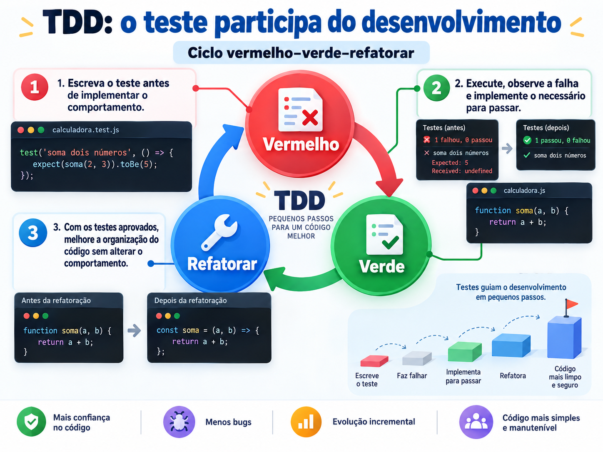
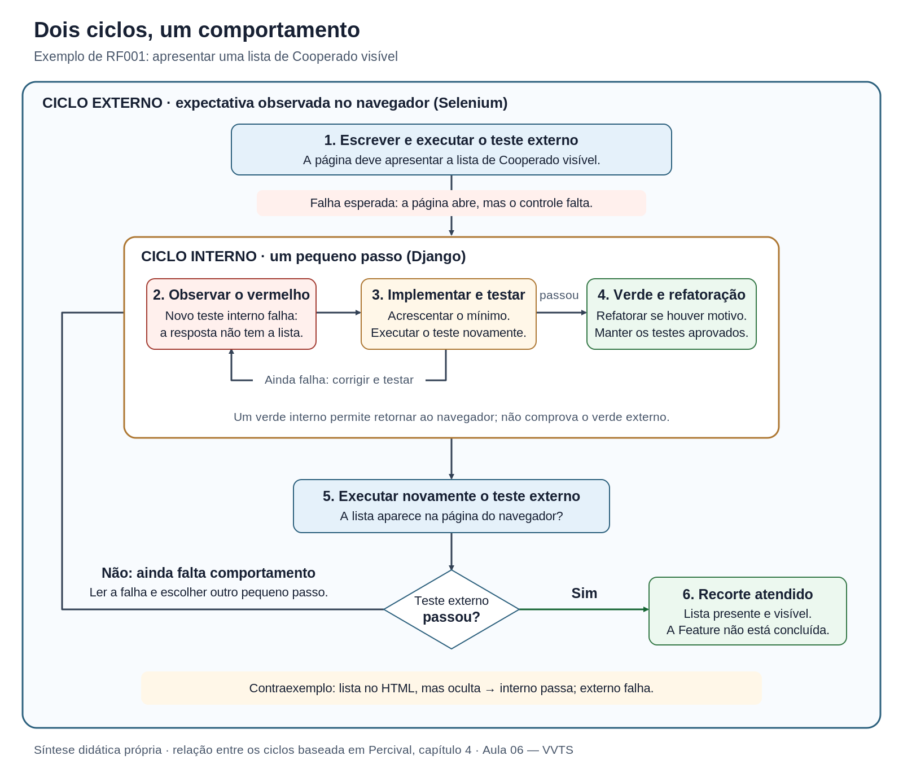

## Introdução ao TDD {.section .lead}


**Do requisito ao primeiro comportamento web**

## Do requisito ao primeiro comportamento web {.section .lead}

**Aula 06 — Introdução ao TDD**

Como uma expectativa do requisito orienta a próxima mudança no código?

[Texto canônico — fonte QMD](_content.qmd){.slide-link}

[Roteiro de laboratório](laboratorio.qmd){.slide-link}

<a href="#codigo-1" class="slide-link" data-code-example="codigo-1" aria-haspopup="dialog">Abrir códigos completos em janela expansível</a>

::: {.notes}
Esta apresentação reorganiza o texto canônico para conduzir perguntas, leitura de código e demonstração. Não acrescenta conteúdo teórico. A aplicação e o ambiente ainda serão preparados em etapa própria. Enquanto isso, trate as transições de execução como expectativas a ensaiar, não como resultados já observados na aplicação da turma.
:::

## A página abriu. Isso basta? {.question}

A página responde, mas a pessoa não encontra onde selecionar Cooperado.

**Qual evidência permite dizer que esse comportamento está correto?**

- O servidor não apresentou erro?
- A palavra “Cooperado” aparece no HTML?
- Existe uma lista de Cooperado visível?

::: {.notes}
Peça uma justificativa antes de revelar a expectativa escolhida. A resposta depende do contrato: o passo da demonstração exige um controle de lista visível, não apenas uma resposta ou uma palavra. Não iniciar por instalação ou por uma enumeração de ferramentas.
:::

## Da mini-RTF ao teste {.concept}

> "Software é uma das construções humanas mais complexas." [@engsoftmoderna, cap. 8, introdução]

A revisão examina o requisito. O teste compara uma observação da execução com uma expectativa justificada.

**Uma expectativa ambígua continua ambígua quando vira código.**

[@pressman2016, seção 22.1.1]

::: {.notes}
Retome a proposta da Aula 05 sem afirmar que todos os grupos concluíram sua revisão. Os registros da mini-RTF ajudam a localizar lacunas e divergências antes de transformá-las em asserções. Revisão e teste se complementam em V&V.
:::

## Cooperado: qual regra vamos testar? {.example}

| Referência | O que registra |
|---|---|
| CA01 — 24482 | Cooperado opcional |
| US — 24495 | Vínculo com Cooperado no registro completo |
| Decisão docente | Cooperado obrigatório no contrato didático |

**Preservar a divergência na origem; explicitar a decisão no teste.**

::: {.notes}
Localizar a Feature 24258, da Epic 24189. Não reescrever o backlog para fingir que ele sempre foi consistente. A indicação de obrigatoriedade na página será uma expectativa de apresentação; rejeição de envio sem Cooperado fica para outro incremento.
:::

## Três alcances sobre a mesma página {.concept}

- **Meta de apresentação:** dez campos, controles, rótulos e indicações de obrigatoriedade de RF001.
- **Passo demonstrado:** título já existente e uma lista de Cooperado visível.
- **Obrigações complementares:** herança de Usina e auditoria, em cenários próprios.

**Aprovar o passo não encerra RF001 nem a Feature.**

::: {.notes}
A apresentação localizada da data pertence à expectativa de apresentação, mas ainda depende da definição do país e do modo de observação. Persistência, submissão e validações não entram na implementação desta aula. Usar essas distinções durante toda a demonstração.
:::

## Wireframe: conversar sobre a estrutura {.example}


<p class="caption">O rascunho ajuda a discutir campos, controles e obrigatoriedade, antes do acabamento visual.</p>

::: {.notes}
Retomar os dez campos de RF001. Perguntar se os controles e as indicações de obrigatoriedade correspondem ao requisito. A figura é uma proposta estática, não evidência de execução.
:::

## Wireframe digital: organizar os controles {.example}


<p class="caption">Exemplo 1 — examinar alinhamento, espaço e ordem de leitura.</p>

::: {.notes}
O editor é fictício. A regularidade permite revisar a estrutura, sem estabelecer ainda a identidade visual do produto. Comparar com o rascunho anterior.
:::

## Wireframe digital: outra representação de RF001 {.example}


<p class="caption">Exemplo 2 — conferir a mesma estrutura em outra representação.</p>

::: {.notes}
As duas imagens do texto canônico estão disponíveis para comparação. A figura não comprova funcionamento, acessibilidade ou usabilidade.
:::

## O protótipo ajuda a perguntar {.example}


<p class="caption">Proposta didática estática de RF001; não é uma tela funcional do BVapp.</p>

::: {.notes}
Apontar Número de Série, Cooperado e Fornecedor, com suas indicações de obrigatoriedade. Perguntar o que a imagem permite revisar e o que não permite verificar. Desenhar um asterisco não prova rejeição de submissão; a imagem também não comprova auditoria, herança, acessibilidade ou usabilidade. Comparar o acabamento com os wireframes dos slides anteriores.
:::

## O que vamos aprender a explicar? {.concept}

- Como requisito, oráculo e asserção se relacionam.
- Por que uma falha é a esperada para o próximo passo.
- Como os ciclos externo e interno orientam a mudança.
- O que permanece estável na refatoração e o que continua pendente.

::: {.notes}
Estes resultados retomam os objetivos do texto canônico. Não apresentar prazos, notas ou regras de entrega. O roteiro organiza evidências de aprendizagem, não uma avaliação nova.
:::

## Antes do seletor, a expectativa {.activity}

**Ao abrir a página, a pessoa encontra uma lista de Cooperado visível.**

Identifique:

1. preparação;
2. ação;
3. resultado esperado;
4. referência que justifica esse resultado.

::: {.notes}
Preparação: página acessível, aplicação em execução e navegador disponível; nenhum painel salvo é necessário. Ação: abrir a página. Resultado: lista visível na página identificada. Referência: RF001 e o contrato didático. A URL e o seletor serão convenções de implementação, não a fonte da obrigação.
:::

## Oráculo e asserção não são a mesma coisa {.concept .definition}

<span class="custom-tooltip">**Oráculo**<span class="tooltip-box">Referência ou mecanismo usado para julgar o resultado observado. Neste exemplo, <strong>RF001 e o contrato didático</strong> justificam a expectativa; não adotamos como correto apenas o que a implementação produziu.</span></span>: o que permite julgar o resultado.

<span class="custom-tooltip">**Asserção**<span class="tooltip-box">Verificação concreta no teste que compara o observado com o esperado. Uma asserção observa <strong>parte do contrato</strong>; sua aprovação não demonstra automaticamente atendimento ao requisito inteiro.</span></span>: a verificação concreta no teste.

**O seletor localiza o controle; o requisito justifica sua presença.**

[@percival2024early, caps. 1–2; @engsoftmoderna, seção 8.2]

::: {.notes}
Pedir que a turma distinga a referência da expectativa do código que a verifica. Uma asserção incorreta pode aprovar uma implementação inadequada. O fato de o teste executar sem erro não valida sua expectativa.
:::

## Onde fica cada responsabilidade? {.example}

| Arquivo da aplicação proposta | Responsabilidade |
|---|---|
| `functional_tests/test_rf001_inclusao_painel.py` | Testes pelo navegador |
| `paineis/tests.py` | Teste interno da resposta |
| `paineis/views.py` | Produção da resposta |
| `paineis/templates/paineis/inclusao.html` | HTML após a extração |

**Repositório novo e separado dos materiais e do backend existente.**

::: {.notes}
A árvore completa está no texto canônico. A organização adapta Percival; RF001 no nome é uma convenção local de rastreabilidade. Configuração, rota, dependências e acesso sem autenticação serão preparados depois. A tabela não afirma que essa aplicação já existe.
:::

## O teste externo observa o navegador {.example}

**Trecho de `PaginaInclusaoPainelTest`:**

```{.python}
# Arquivo: bvapp-didatico/functional_tests/test_rf001_inclusao_painel.py
# Trecho do método test_pagina_apresenta_lista_de_cooperados.
self.browser.get(f"{self.live_server_url}/paineis/novo/")
titulo = self.browser.find_element(By.TAG_NAME, "h1")
self.assertEqual(titulo.text, "Inclusão de painel solar")
controles = self.browser.find_elements(
    By.CSS_SELECTOR, 'select[name="cooperado"]'
)
```

**Primeiro: confirmar a página. Depois: procurar o controle.**

<a href="#codigo-1" class="slide-link" data-code-example="codigo-1" aria-haspopup="dialog">Ver teste externo completo</a>

::: {.notes}
Não executar este fragmento isoladamente. A classe completa e seus imports estão no texto canônico. StaticLiveServerTestCase oferece o servidor temporário; setUp abre o navegador e addCleanup registra seu encerramento. Selenium observa a página. Os nomes da URL e do controle são convenções da demonstração.
:::

## A expectativa precisa de asserções {.example}

```{.python}
# Arquivo: bvapp-didatico/functional_tests/test_rf001_inclusao_painel.py
# Continuação do mesmo método; mensagens completas no texto canônico.
self.assertEqual(len(controles), 1)
self.assertTrue(controles[0].is_displayed())
```

- Lista ausente: a primeira asserção falha.
- Lista oculta: a verificação de visibilidade falha.
- Título errado: ainda não confirmamos a página esperada.

<a href="#codigo-1" class="slide-link" data-code-example="codigo-1" aria-haspopup="dialog">Ver classe, imports e mensagens das asserções</a>

::: {.notes}
Na aplicação preparada, mostrar primeiro a falha causada pela lista ausente. O método para na asserção de quantidade, sem acessar o primeiro item de uma lista vazia. As mensagens explicativas do exemplo completo devem permanecer no teste real; este slide reduz apenas o trecho projetado.
:::

## Vermelho por qual motivo? {.question}

| Observação | Como interpretar |
|---|---|
| Página correta, controle ausente | Comportamento ainda não implementado |
| Navegador indisponível | Falha de infraestrutura |
| Página inesperada | Investigar o acesso antes de julgar Cooperado |

**Registre o motivo observado, não apenas “falhou”.**

::: {.notes}
Perguntar qual resultado orienta a inclusão do controle. Uma falha de infraestrutura não é evidência da ausência de comportamento. O laboratório prevê interrupção do ciclo para resolver essa condição, sem fabricar um Vermelho ou enfraquecer o teste.
:::

## Vermelho, verde e refatorar {.concept}



[@engsoftmoderna, seção 8.7; @percival2024early, caps. 1–4]

::: {.notes}
Retomar a sequência do texto canônico: escrever o teste, explicar a falha, implementar o necessário e, com os testes aprovados, avaliar a organização do código sem mudar o comportamento.
:::

## Um ciclo dentro do outro {.concept}



[@percival2024early, cap. 4, seção "Double-loop TDD"]

::: {.notes}
Este é o mesmo diagrama do texto canônico, uma síntese didática baseada em Percival. Clique na imagem para ampliá-la durante a leitura das setas. Verde interno autoriza conferir a expectativa externa; não permite presumir sua aprovação. Se o teste interno continuar falhando, investigar e corrigir esse passo antes de voltar ao externo. Não confundir CenariosRF001Test, externo e abrangente, com o teste interno.
:::

## Qual responsabilidade interna atende ao passo? {.question}

**A resposta da aplicação deve conter o HTML da lista.**

Podemos inspecionar essa resposta sem abrir o navegador.

Isso responde a uma pergunta menor:

**O fragmento está na resposta?**

Não responde ainda: **a pessoa vê o controle?**

::: {.notes}
Introduzir RespostaInclusaoPainelTest, em paineis/tests.py. O cliente percorre a solicitação no Django. Não chamar automaticamente esse teste de unidade isolada: rota, view e, depois, template participam do atendimento.
:::

## A resposta já existe? {.example}

```{.python}
# Arquivo: bvapp-didatico/paineis/tests.py
# Método de RespostaInclusaoPainelTest(SimpleTestCase).
def test_pagina_responde_com_sucesso(self):
    resposta = self.client.get("/paineis/novo/")
    self.assertEqual(resposta.status_code, 200)
```

Na situação inicial escolhida, esse teste **já deve passar**.

**Ele confirma uma condição existente; não dirige a inclusão da lista.**

<a href="#codigo-7" class="slide-link" data-code-example="codigo-7" aria-haspopup="dialog">Ver classe completa do teste interno</a>

::: {.notes}
A página com o título deve estar disponível no estado inicial da prática. Se não responder, resolver essa condição primeiro. Não apresentar um teste que já passa como o novo Vermelho da inclusão de Cooperado.
:::

## O novo teste interno deve falhar {.example}

```{.python}
# Arquivo: bvapp-didatico/paineis/tests.py
# Trecho de test_resposta_contem_lista_de_cooperados.
resposta = self.client.get("/paineis/novo/")
controle_esperado = """
    <select id="cooperado" name="cooperado">
        <option value="">Selecione um cooperado</option>
    </select>
"""
self.assertContains(resposta, controle_esperado, count=1, html=True)
```

**A resposta existe, mas ainda não contém a lista.**

<a href="#codigo-7" class="slide-link" data-code-example="codigo-7" aria-haspopup="dialog">Ver teste interno completo</a>

::: {.notes}
O fragmento e a opção inicial retomam o exemplo canônico. count=1 exige uma ocorrência; html=True compara a estrutura HTML. Não verifica a renderização nem a visibilidade. Na prática, introduzir o método antes da mudança na view e registrar a falha real pelo motivo esperado. Classe completa no texto canônico [@djangoTestingTools52, seções "The test client" e "Assertions"].
:::

## Verde: atender à expectativa atual {.example}

**Trecho do HTML devolvido pela view:**

```{.html}
<!-- Arquivo: bvapp-didatico/paineis/views.py (trecho da string HTML) -->
<h1>Inclusão de painel solar</h1>
<label for="cooperado">Cooperado</label>
<select id="cooperado" name="cooperado">
    <option value="">Selecione um cooperado</option>
</select>
```

**Executar os testes internos e retornar ao teste externo.**

<a href="#codigo-2" class="slide-link" data-code-example="codigo-2" aria-haspopup="dialog">Ver view completa com HttpResponse</a> · <a href="#codigo-8" class="slide-link" data-code-example="codigo-8" aria-haspopup="dialog">Ver fragmento HTML</a>

::: {.notes}
A implementação completa usa HttpResponse e está no texto canônico. Preservar o título e os comportamentos já existentes. Não acrescentar cadastros auxiliares, registros inventados ou persistência. A lista vazia com orientação inicial não atende aos demais campos ou à indicação de obrigatoriedade. Não declarar um resultado executado enquanto a aplicação não tiver sido preparada.
:::

## Refatorar sem mudar a expectativa {.example}

```{.python}
# Arquivo: bvapp-didatico/paineis/views.py
from django.shortcuts import render


def pagina_inclusao_painel(request):
    return render(request, "paineis/inclusao.html")
```

Mover o mesmo HTML para `paineis/templates/paineis/inclusao.html`.

**Executar novamente os testes internos e externos.**

<a href="#codigo-3" class="slide-link" data-code-example="codigo-3" aria-haspopup="dialog">Ver view refatorada</a> · <a href="#codigo-4" class="slide-link" data-code-example="codigo-4" aria-haspopup="dialog">Ver template completo</a>

::: {.notes}
A extração separa apresentação e produção da resposta. Não exige React ou outra biblioteca de frontend. O comportamento do passo permanece: título e lista visível. Não alterar asserções para acomodar uma perda de comportamento. Antes da execução, o projeto deverá estar configurado para localizar o template. A refatoração é justificada pelo problema de organização, não obrigatória em todo ciclo [@engsoftmoderna, seção 8.7].
:::

## Verde interno garante Verde externo? {.question}

```{.html}
<!-- Arquivo: bvapp-didatico/paineis/templates/paineis/inclusao.html -->
<!-- Contraexemplo: ocultação do mesmo controle. -->
<div hidden>
    <label for="cooperado">Cooperado</label>
    <select id="cooperado" name="cooperado">
        <option value="">Selecione um cooperado</option>
    </select>
</div>
```

**Preveja o resultado de cada teste antes de executar.**

<a href="#codigo-9" class="slide-link" data-code-example="codigo-9" aria-haspopup="dialog">Ver contraexemplo de ocultação</a>

::: {.notes}
O título deve permanecer fora do elemento oculto. Este é um experimento didático temporário, não uma refatoração que preserva comportamento. A comparação interna do select pode passar; a asserção externa is_displayed deve falhar. Depois, retirar a ocultação e executar ambos novamente. Sem ambiente, registrar somente a previsão e a justificativa.
:::

## O retorno ao navegador muda a conclusão {.takeaway}

| Lista | Teste interno do HTML | Teste externo da visibilidade |
|---|---|---|
| Ausente | Falha | Falha |
| Presente e oculta | Passa | Falha |
| Presente e visível | Passa | Passa |

**A aprovação cobre a observação de cada teste.**

::: {.notes}
Tabela de resultados esperados sob as condições do exemplo, não um relatório de execução da futura aplicação. Pedir que a turma explique a segunda linha. A correção deve remover a causa da ocultação e preservar asserções; observar novamente antes de encerrar o passo.
:::

## E os demais campos de RF001? {.example}

`PaginaInclusaoPainelTest`: o pequeno passo da lista visível.

`CenariosRF001Test`: apresentação dos dez campos, tipos, rótulos e asteriscos.

**Ambos são externos e independentes.**

O primeiro pode passar enquanto o segundo ainda falha.

<a href="#codigo-5" class="slide-link" data-code-example="codigo-5" aria-haspopup="dialog">Ver cenário somente comentado</a> · <a href="#codigo-6" class="slide-link" data-code-example="codigo-6" aria-haspopup="dialog">Ver cenário completo com código</a>

::: {.notes}
Não projetar a classe longa inteira no slide. Abrir a janela de código para localizar uma sequência de comentário, ação e asserção; usar a rolagem e ampliar a janela conforme necessário. Os testes de data localizada, herança e auditoria estão explicitamente ignorados por contratos pendentes. Um skip não é aprovação. Desenvolver novas expectativas em pequenos passos, sem exigir a suíte inteira da Feature antes da implementação.
:::

## Teste ignorado não é requisito atendido {.concept}

**Pendências explícitas no exemplo:**

- apresentação da data conforme o país configurado;
- informações de Usina herdadas do Inversor;
- inclusão e consulta do registro de auditoria.

`@skip` registra o motivo da pendência; não verifica o comportamento.

::: {.notes}
Não remover marcadores apenas para aumentar a quantidade de testes executados. As ações e os oráculos ainda precisam ser definidos. A auditoria não vira um campo para a pessoa preencher. Nenhum limite, dado ou meio de consulta deve ser inventado para completar o exemplo.
:::

## Classificar pelo que o teste faz {.activity}

Para cada teste, explique separadamente:

- **alcance:** quais componentes são exercitados;
- **base de elaboração:** de onde veio a expectativa;
- **execução:** como a observação foi automatizada;
- **papel:** qual passo do desenvolvimento ele orienta.

**Django não significa unidade isolada; Selenium não significa aceitação completa.**

[@engsoftmoderna, seções 8.2 e 8.7–8.10]

::: {.notes}
Aplicar ao mesmo exemplo, sem acrescentar técnicas. O cliente Django percorre rota/view/template; o navegador acrescenta a observação da interface. Ler o código não torna automaticamente um caso de caixa-branca. TDD é uma prática de desenvolvimento, não um nível de teste.
:::

## Preservar o que já foi verificado {.concept}

> "testes ganharam novas funções, como verificar se uma classe continuará funcionando após um bug ser corrigido em uma outra parte do sistema." [@engsoftmoderna, cap. 8, introdução]

Após a mudança, executar novamente os testes já aprovados.

**Regressão detectada exige investigação, não redução da expectativa.**

::: {.notes}
Relacionar a futura evolução do formulário à lista de Cooperado e à sua indicação de obrigatoriedade quando ela tiver teste. Esses testes não passam a cobrir automaticamente gravação ou auditoria. Conformidade com expectativas codificadas também não substitui a análise de sua adequação às necessidades da pessoa usuária.
:::

## Agora, o comportamento da sua Epic {.activity}

1. Localize um requisito e uma expectativa pequena.
2. Descreva preparação, ação, resultado e oráculo.
3. Explique a falha esperada antes da mudança.
4. Identifique os testes interno e externo e as pendências.

[Roteiro: da análise ao ciclo observado](laboratorio.qmd){.slide-link}

::: {.notes}
Os grupos transferem o método, não o cadastro de painéis, para sua própria Epic. A aplicação será nova e isolada. A análise pode começar com requisitos e registros da mini-RTF; a execução exige a etapa posterior de preparação. Não aplicar à Aula 06 as regras de subentrega da Aula 05.
:::

## Qual evidência permite encerrar o passo? {.takeaway}

**Requisito → expectativa → falha explicada → mudança → nova observação.**

Registrar também:

- resultados após a refatoração;
- alcance de cada teste;
- obrigações ainda pendentes.

**Encerrar o passo observado, não declarar a Feature concluída.**

::: {.notes}
Pedir uma conclusão que diga qual teste passou e o que ele observa. Se só houve leitura ou previsão, o registro deve dizê-lo. Uma execução aprovada não corrige uma interpretação errada do requisito. Não estabelecer formato obrigatório de entrega, prazo ou critério de nota.
:::

## Para retomar o percurso {.concept}

- **Percival:** capítulos 1–4 do PDF adotado; ciclo externo, passos internos e retorno ao navegador [@percival2024early].
- **Valente:** capítulo 8, seções 8.2 e 8.7–8.10 [@engsoftmoderna].
- **Pressman e Maxim:** capítulo 22, especialmente 22.1.1 [@pressman2016].

[Texto canônico — fonte QMD](_content.qmd){.slide-link} · [Roteiro](laboratorio.qmd){.slide-link}

::: {.notes}
A leitura usa a terceira edição Early Release fornecida, revisão de 16 de maio de 2024. As referências da organização de arquivos e dos recursos de teste estão localizadas no texto canônico. Não antecipar persistência: ela será o eixo do encontro seguinte.
:::

## Referências {.smaller}

::: {#refs}
:::
